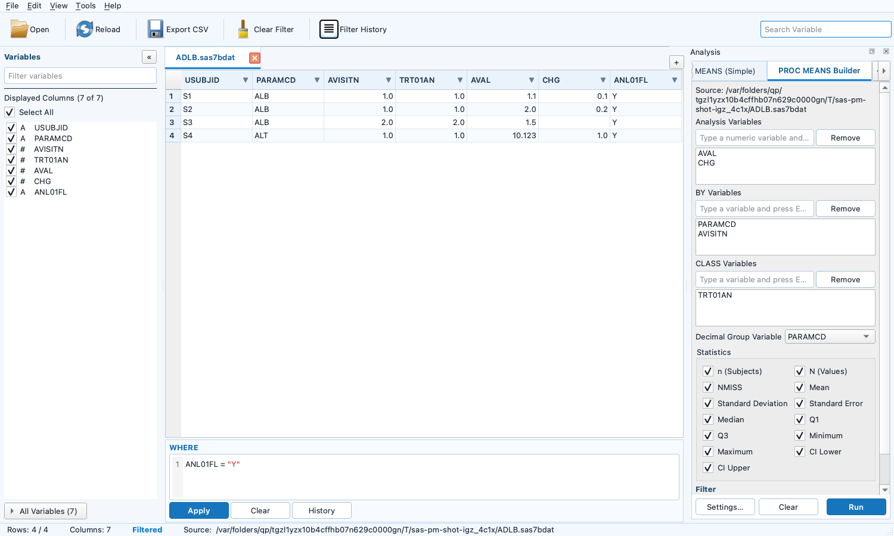
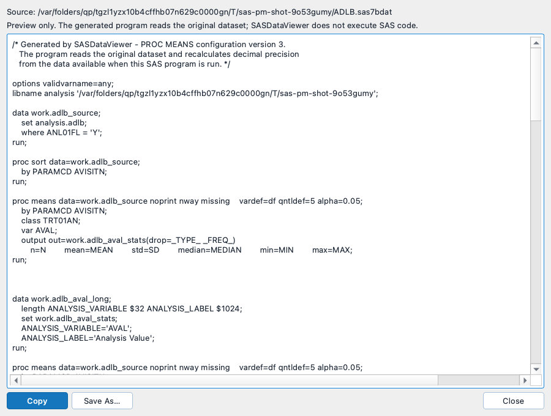

# SASDataViewer

[中文](README.md) | [English](README.en.md)

A compact, read-only Windows desktop viewer for clinical `.sas7bdat` and SAS Transport `.xpt` datasets. SASDataViewer uses PySide6, pyreadstat, paged `QTableView` rendering, and a SQLite cache so that day-to-day browsing stays responsive without holding the original SAS file open.

## Features

| Area | Supported functionality |
| --- | --- |
| Datasets | Open multiple `.sas7bdat` / `.xpt` files in tabs; open files from the command line or Windows file association. |
| File safety | Copy the source to a session temporary directory, read only the copy/cache, and clean temporary data on tab close and application exit. |
| Large data | Show metadata and the first batch quickly, then continue caching in the background. Virtual paging avoids rendering the full dataset at once. |
| Variables | Collapsible Variables panel, search, metadata, column visibility, Select All, and variable-to-column navigation. |
| Filtering | Hand-written SAS-like WHERE expressions, Excel-style column filters, filter history, column-to-column comparisons, and missing-value conditions. |
| Navigation | Sortable columns, `Ctrl+F`/`F3` search, `Ctrl+G` row navigation, copy cells/rows/ranges, and horizontal/vertical scrolling. |
| Analysis | PROC MEANS Simple, PROC MEANS Builder, Categorical Table, row comparison, Dataset Compare, and temporary result tabs. |
| Export | Background CSV export of the current filtered result, current visible columns, and current sort order. UTF-8 BOM is used. |
| Code generation | SAS and R PROC MEANS code generators based on the same language-neutral JSON v3 configuration. |

The interface follows a compact Windows 11 / SAS Studio-style layout: menu bar, toolbar, dataset tabs, Variables panel, data table, WHERE editor, and status bar.


## User guide

### Start the application

Most users should run the packaged `SASDataViewer.exe`; Python and SAS are not required on the target computer. For source-code execution, use 64-bit Python 3.11 or newer:

```powershell
cd C:\path\to\sas7bdat-viewer
python -m venv .venv
.\.venv\Scripts\Activate.ps1
python -m pip install -r requirements.txt
python -m clinical_data_viewer
```

The project declares `requires-python >=3.11`; it does not pin a specific patch or upper Python version.

### Common operations

#### Open, browse, and manage columns

| Action | How to use it | Notes |
| --- | --- | --- |
| Open datasets | Click `Open`; select one or more `.sas7bdat` / `.xpt` files | Each file gets its own tab. |
| Direct open | Run `SASDataViewer.exe "C:\project data\中文\adae.sas7bdat"`, or associate `.sas7bdat` / `.xpt` with the EXE | Spaces and non-ASCII paths are supported. The current version uses multiple windows. |
| Sort | Click a column header; click again to reverse the order | Equal values remain stable by source row order. |
| Choose columns | Check variables in the Variables panel | `Select All` toggles all variables and can restore them after clearing the selection. |
| Inspect metadata | Expand `All Variables` | Shows Variable, Label, Type, Length, and Format. |
| Copy | Select a cell, row, or range and press `Ctrl+C` | The context menu can also copy column names. |

#### Filter and navigate

| Action | Shortcut or entry point | Notes |
| --- | --- | --- |
| Hand-written WHERE | Bottom WHERE editor, `Apply`, or `Ctrl+Enter` | Supports comparisons, column-to-column comparisons, `IN`, `BETWEEN`, `CONTAINS`, `LIKE`, missing checks, and logical operators. Invalid input stays in the editor with an error message. |
| Column filter | Click the `▼` at the right of a header | Supports values, Missing, numeric Between, and character Contains; the generated condition is synchronized to WHERE. |
| Exact value filter | Search a loaded value such as `ALB` | Generates `PARAMCD in ("ALB")`, not `not missing(PARAMCD)`. |
| Text search | `Ctrl+F`, `F3`, `Shift+F3` | Searches the current filtered result and visible columns. |
| Go to row | `Ctrl+G` | Enter a 1-based row number in the current result. |
| Filter history | `Filter History` | Restore, delete, or clear successful WHERE conditions. Applying is required after a condition is filled back in. |
| Clear filter | `Clear Filter` or `Clear` | Restores the display without changing source data. |

#### Analysis and export

| Feature | Entry point | Result |
| --- | --- | --- |
| PROC MEANS Simple | Right-click a numeric column → `PROC MEANS (Simple)` | Statistics for the current filtered result. `n (Subjects)` is distinct nonmissing `USUBJID`; `N (Values)` is the number of nonmissing analysis values. |
| PROC MEANS Builder | `Tools > PROC MEANS Builder` | Multiple Analysis/BY/CLASS variables, Decimal Group Variables, statistics, a long-format temporary result tab, and configuration JSON. |
| Categorical Table | `Tools > Categorical Table Builder` | Multiple categorical items, treatment `n (%)`, denominator strategies, Total, and temporary result tabs. |
| SAS/R code | `SAS Code Generator…` or `R Code Generator…` in Builder | Read-only code preview and Save As; SAS/R is not executed by the viewer. |
| Row comparison | Select multiple row numbers with `Ctrl`, then right-click Compare | Highlights only different columns in the selected rows. |
| Dataset Compare | `Tools > Compare Datasets` | Main/QC matching, difference output, warning rows, source-row navigation, filtering, sorting, and CSV export. |
| CSV export | `Export CSV` | Exports current filtered rows, visible columns, and current sort order in the background. |
| Reload | `Reload` | Recreates the temporary copy from the original path and attempts to preserve WHERE and visible columns. |

While a large dataset is still caching, the table shows a `Rows cached` status. Browsing, copying, and column selection remain available; filtering, sorting, search, row navigation, and export wait for the complete cache so that results cannot be incomplete.

### Source files and temporary data

The original file is opened only long enough to create a session copy. After that, pyreadstat and SQLite read the temporary copy/cache, so SAS can overwrite, delete, or regenerate the original file.

Typical Windows locations:

```text
%LOCALAPPDATA%\ClinicalDataViewer\temp\cde-<time>-<pid>-<id>\<dataset-id>\
%LOCALAPPDATA%\ClinicalDataViewer\filter_history.sqlite
%LOCALAPPDATA%\ClinicalDataViewer\settings.json
```

Closing a dataset tab removes its temporary directory. Normal exit removes the session directory; startup also removes stale directories from abnormal exits. Filter history stores the original path, filename, WHERE text, and UTC time, not data rows.

## PROC MEANS module

PROC MEANS is read-only and never writes back to SAS7BDAT. Simple analyzes one numeric variable. Builder supports multiple Analysis, BY, and CLASS variables and writes a temporary long-format SQLite result tab.

### Statistics and precision

- `n (Subjects)`: distinct nonmissing `USUBJID` values among rows where the analysis variable is nonmissing.
- `N (Values)`: nonmissing analysis observations.
- `NMISS`: missing analysis observations.
- Mean, sample SD, SE, Median, Q1, Q3, Min, Max, LCLM, and UCLM.
- Q1/Q3/Median follow the Python implementation of SAS `QNTLDEF=5`.
- BY and CLASS are stored separately but both participate in grouping; CLASS uses NWAY semantics and retains missing groups.

Settings support `+0` through `+4` decimal offsets for each statistic. The final display precision is:

```text
min(observed base decimals + statistic offset, 4)
```

Builder can infer base precision by Analysis Variable plus the complete Decimal Group combination. SQLite keeps full precision; table and CSV use the same half-up display formatting.

### Configuration JSON and code generators

Builder writes `proc_means_config.json` next to the temporary result. JSON v3 is shared by the SAS and R generators and stores the original source path, variable metadata, the Python WHERE AST, Analysis/BY/CLASS variables, statistics, Python calculation semantics, and dynamic decimal rules. It does not store a viewer temp path or a fixed precision for one parameter.

The SAS generator renders Jinja2 templates under `clinical_data_viewer/codegen/sas/templates/`. Work members use the lower-case source dataset prefix, for example `work.adlb_source` and `work.adlb_aval_stats`; the final result remains `work.proc_means_result`.

The R generator renders `clinical_data_viewer/codegen/r/templates/proc_means.R.j2`. It uses `haven::read_sas()` for SAS7BDAT and `haven::read_xpt()` for XPT, the saved Python WHERE AST, missing-aware grouping, the Python PROC MEANS statistics contract, dynamic precision inference, and half-up display columns. Install the R dependency once with:

```r
install.packages("haven")
```

Generated scripts produce a `proc_means_result` data frame. The viewer previews and saves code but does not execute SAS or R.





## Categorical Table module

Open `Tools > Categorical Table Builder` to configure one or more categorical Items, treatment and subject-ID variables, the counting unit, percent digits, and a denominator strategy. Run creates a paged `Categorical Table Result` SQLite tab which retains normal visible-column selection, WHERE filtering, sorting, copying, and CSV export. Its default clinical-table layout uses a bold Item header row, indented Levels, and treatment/Total `freq (percent)` columns.

| Denominator | Source and rule |
| --- | --- |
| Population N | A user-opened or browsed ADSL dataset. The population WHERE, treatment, subject ID, and context variables are configurable; Total is recomputed for the full eligible ADSL population. |
| Non-missing N | The current analysis dataset, restricted to a configurable non-missing analysis-value variable. |
| Baseline + Postbaseline n1 | The current analysis dataset. Baseline and postbaseline WHERE predicates are required. A postbaseline record is eligible only when the same treatment/context/subject has an eligible baseline record. Record-count mode does not deduplicate. |

Each Item can have its own context variables, such as `PARAMCD + AVISIT`, and may opt into a `(Missing)` level. The same session SQLite retains an authoritative long table with `ITEM`, `ITEM_LABEL`, context variables, `LEVEL`, `TRT`, `FREQ`, `DENOM`, and `PCT`. With the default Result tab active, select `View > Open Categorical Long Result` to open it as an independent normal Viewer tab with WHERE, sorting, visible-column selection, and CSV export. Double-clicking a populated `n (%)` cell offers Numerator Records, Numerator Subjects, and Denominator Subjects as independent temporary query tabs. Categorical configuration JSON save/load is intentionally deferred; only the session result/configuration is retained while the result tab remains open.

## Dataset Compare module

`Tools > Compare Datasets` opens the right-side panel. Select or browse a Main dataset and a QC dataset. The comparison always uses the complete original caches and ignores the current WHERE, visible columns, and sort order of the input tabs.

| Setting | Behavior |
| --- | --- |
| Group Variables | Up to three variables with identical values and frequencies can be recommended automatically; users can adjust them. |
| Match Variables | All comparable common variables are selected by default. Weights and numeric tolerance are configurable. |
| Key Variables | Optional; controls which differences are emitted, but does not force observation matching. |
| Matching | Within each group, weighted costs and a Hungarian one-to-one assignment determine Main/QC pairs. Threshold and ambiguity checks can reject unsafe matches. |
| Output status | `Different`, `Main only`, `QC only`, `Unmatched`, and `Ambiguous`. Main/QC-only and unmatched records are shown as warnings with a pale red background. |
| Result tab | Temporary SQLite-backed tab with Main followed immediately by QC for each pair. It supports WHERE, column filters, sorting, copying, source navigation, and CSV. |
| Advanced details | `COMPARE_PAIR`, `MATCH_COST`, and `MATCH_MARGIN` are hidden by default. They may be displayed in the result tab, but are never exported to CSV. |

Compare Result does not create a SAS file. Closing the tab removes its temporary SQLite. It cannot be reloaded, re-compared, or used as a PROC MEANS source.

## System testing and packaging

### Test environment

Run the following on Windows 10/11 64-bit before release:

```powershell
cd C:\path\to\sas7bdat-viewer
python -m venv .venv
.\.venv\Scripts\Activate.ps1
python -m pip install --upgrade pip
python -m pip install -r requirements-build.txt
python --version
python -c "import PySide6, pyreadstat, jinja2; print('PySide6 OK'); print('pyreadstat', pyreadstat.__version__); print('Jinja2', jinja2.__version__)"
```

### Automated checks

```powershell
ruff check clinical_data_viewer tests run.py
ruff format --check clinical_data_viewer tests run.py
python -m compileall -q clinical_data_viewer tests run.py
python -m unittest discover -s tests -v
```

Expected results:

- Ruff reports `All checks passed!`.
- Compilation exits successfully.
- The test suite reports `OK`; the UI smoke test should not be skipped when PySide6 is installed.
- Tests cover WHERE parsing/type validation, paging/filtering/sorting, CSV and UTF-8 BOM, history persistence, temp cleanup, PROC MEANS JSON v3 and code generation, SAS/R runtime decimal behavior, and Dataset Compare matching/output rules.

### Manual acceptance checklist

Use copies of real SDTM/ADaM files, not the only production copy. Check the following:

1. Open 2–3 datasets and verify tabs, row counts, column counts, and metadata.
2. Clear all selected variables, click Select All again, and verify that every variable returns.
3. Test sorting, cell/row/range copying, WHERE syntax, column-to-column comparisons, column filters, Filter History, `Ctrl+F`, `Ctrl+G`, and CSV output.
4. Run PROC MEANS Simple and Builder, including missing groups, multiple Decimal Group Variables, long-format output, query drill-down, JSON v3, SAS/R code preview, and precision offsets.
5. Test Row Comparison with non-contiguous Ctrl-selected rows; only selected rows and differing columns should be highlighted.
6. Test Dataset Compare with reordered rows, duplicate groups, tolerance, threshold, ambiguity, Main/QC-only records, one-sided variables, source navigation, Advanced details, filtering, sorting, and CSV exclusion of internal fields.
7. Close and reopen the application; verify WHERE history restoration and stale temporary-directory cleanup.
8. Launch the EXE with `.sas7bdat` and `.xpt` paths containing spaces and non-ASCII characters, and test both file associations.

### Verify the source file is not held open

Create a dedicated test copy, open it, wait for caching to complete, then in another PowerShell window run:

```powershell
Remove-Item ".\manual-test\lock-test.sas7bdat"
Copy-Item ".\manual-test\lock-test-backup.sas7bdat" ".\manual-test\lock-test.sas7bdat"
```

Both commands should succeed while the old tab remains browsable.

### Build a Windows ZIP

Build on Windows. macOS cannot cross-build a usable Windows EXE with PyInstaller. The project uses PyInstaller `onedir`; the release artifact is a ZIP containing the full program directory.

Recommended:

```powershell
Set-ExecutionPolicy -Scope Process Bypass
.\scripts\build_windows.ps1
```

The script accepts any Python 3.11+ interpreter without hard-coding a patch version:

```powershell
.\scripts\build_windows.ps1 -PythonExe "C:\Path\To\Python311\python.exe"
.\scripts\build_windows.ps1 -PythonExe "C:\Path\To\Python311\python.exe" -RecreateVenv
```

It creates/updates `.venv`, installs dependencies, runs checks and tests, builds the GUI `onedir`, creates `dist\SASDataViewer-Windows-x64.zip`, and prints artifact sizes and SHA256 values.

Manual equivalent:

```powershell
python -m venv .venv
.\.venv\Scripts\Activate.ps1
python -m pip install -r requirements-build.txt
ruff check clinical_data_viewer tests run.py
ruff format --check clinical_data_viewer tests run.py
python -m compileall -q clinical_data_viewer tests run.py
python -m unittest discover -s tests -v
pyinstaller --noconfirm --clean SASDataViewer.spec
Compress-Archive -Path .\dist\SASDataViewer `
    -DestinationPath .\dist\SASDataViewer-Windows-x64.zip `
    -CompressionLevel Optimal
```

Expected release layout:

```text
dist\SASDataViewer\SASDataViewer.exe
dist\SASDataViewer\_internal\...
dist\SASDataViewer-Windows-x64.zip
```

Verify the archive on a clean Windows computer:

```powershell
Get-FileHash .\dist\SASDataViewer-Windows-x64.zip -Algorithm SHA256
Expand-Archive .\dist\SASDataViewer-Windows-x64.zip .\dist\zip-test -Force
Start-Process .\dist\zip-test\SASDataViewer\SASDataViewer.exe
& .\dist\zip-test\SASDataViewer\SASDataViewer.exe "C:\clinical test\中文\adae.sas7bdat"
```

Keep the EXE and `_internal` directory together. The build is unsigned, so Windows SmartScreen may show an unknown-publisher warning. Code signing can be added for an internal release.

## Project structure

```text
clinical_data_viewer/
  compare_engine/     streaming grouping, weighted matching, comparison, temp results
  proc_means/         Builder configuration, grouped statistics, SQLite results, JSON
  codegen/sas/        SAS Jinja2 generator and templates
  codegen/r/          R Jinja2 generator and templates
  filter_ast.py       language-neutral serialization of the Python WHERE AST
  ui/                 PySide6 main window, tabs, Variables, history, copy actions
  sas_reader.py       pyreadstat metadata/chunk loading and SQLite cache
  temp_manager.py     source copies, session cleanup, stale-directory cleanup
  table_model.py      QAbstractTableModel lazy paging
  where_parser.py     SAS-like WHERE lexer/parser
  filter_engine.py    metadata validation and parameterized SQL
  statistics.py       PROC MEANS statistics, QNTLDEF=5, and Student-t CI
  workers.py          QThreadPool/QRunnable workers
assets/               source PNG and multi-size Windows ICO icon
tests/                core regression and UI smoke tests
```

## License

MIT
