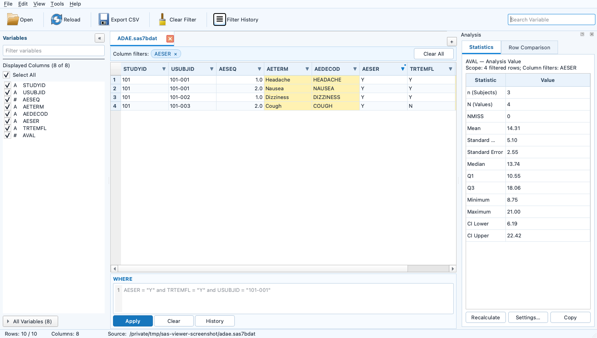

# SASDataViewer

独立的 Windows 临床 SAS 数据集浏览器。它只读打开 `.sas7bdat`，采用 PySide6 原生桌面界面、pyreadstat 分块读取和磁盘 SQLite 查询缓存，目标是在日常查看大数据集时保持界面响应。

## 已实现功能

- 同时打开多个 `.sas7bdat`，使用可关闭、可移动的 Tab 切换。
- 源文件先分块复制到本次会话的临时目录；复制结束后，读取、筛选、排序和导出都只访问临时文件/缓存。
- 关闭 Tab 清理对应副本；退出清理整个会话；启动时清理超过 24 小时且不属于仍在运行进程的异常退出遗留目录。
- 大文件复制完成后先读取 metadata 和首批 20,000 行并显示 Tab，其余行继续在后台写入本地缓存；缓存期间仍可浏览首批及随后到达的数据。
- `QTableView + QAbstractTableModel` 虚拟行模型，每页默认 500 行、内存中只保留有限页面；可以直接滚动/跳到远端页面，不需要先加载前面的所有行。
- 可折叠 Variables 面板、显示列勾选、Select All、变量定位、变量搜索，以及 Variable/Label/Type/Length/Format metadata。
- 手写 SAS-like WHERE；支持列与常量或列与列比较，例如 `AESTDTC <= AEENDTC`。
- 比较符支持 `=`/`EQ`、`!=`/`^=`/`~=`/`<>`/`NE`、`>`/`GT`、`>=`/`GE`、`<`/`LT`、`<=`/`LE`，以及字符前缀修饰符 `=:` 等。
- 逻辑与条件支持 `AND`/`&`、`OR`/`|`/`!`、`NOT`/`^`/`~`、`IN`、`NOT IN`、`BETWEEN ... AND ...`、`CONTAINS`/`?`、`LIKE`、`IS NULL`、`IS MISSING`、`MISSING()` 和括号。
- `Ctrl+Enter` 或 Apply 执行；语法/类型/变量错误会指出原因和位置，并保留输入。
- 成功 WHERE 历史持久化；支持当前数据集/全部数据集、回填、单条删除和清空。列头互动筛选会同步生成可编辑的 SAS-like WHERE，并与手写条件作为一条完整条件保存。
- CSV 仅导出“当前筛选结果 + 当前显示列”，并保持当前排序；编码为 UTF-8 BOM，后台分批写出。
- 列头右侧的筛选箭头提供 Excel 风格互动筛选：可搜索/勾选当前值，也可按 `=`、`!=`、大小比较、Between 和 Contains 设置条件。不同列之间按 AND 组合，并与手写 WHERE 一起生效；完整条件会同步到 WHERE 编辑框，蓝色筛选标签可逐列清除。
- 数值列右键提供 `PROC MEANS`；统计基于“手写 WHERE + 列头筛选”后的完整结果，后台计算固定 `USUBJID` 受试者数、非缺失 N、NMISS、Mean、SD、SE、Median、Q1、Q3、Min、Max 和均值 Student-t CI。
- `Tools > Analysis` 可随时显示/隐藏右侧 Analysis 面板；右键 `Settings…` 或 Tools > Settings 可分别设置 Mean、SD、SE、Median、Q1、Q3、Min、Max 和 CI 等统计量的 0–10 位小数，并设置显示统计量和置信水平。计数类 n/N/NMISS 保持整数；显示采用 `ROUND_HALF_UP` 四舍五入，不改变计算值或原值；非数值列的 PROC MEANS 菜单自动禁用。
- 在行号区域用 `Ctrl+click` 可非连续选择 2–20 行，然后右键 Compare Selected Rows；程序比较所有变量，只在参与比较的行中用浅黄色标出有差异的单元格，并在右侧 Analysis > Row Comparison 列出各行值。
- `Tools > Compare Datasets` 打开右侧比较面板；Main/QC 可从已打开 Tab 选择，也可 Browse 新的 `.sas7bdat`。按 Group Variables 分组，以带权 Match Variables、数值 tolerance、Hungarian 全局一对一匹配、threshold 和 ambiguity margin 确定 observation 对应关系；Key Variables 只控制正式差异输出。结果写入会话临时 SQLite，以 Main/QC 相邻行的新 Tab 展示并高亮差异单元格，不生成 SAS 文件。
- `Ctrl+F` 在当前筛选、排序结果的当前显示列中查找文本；`F3`/`Shift+F3` 查找下一个/上一个；`Ctrl+G` 按当前结果行号跳转。
- Reload 从原始路径生成新副本，并尽量保留显示列、WHERE 输入和已应用筛选；大文件重新缓存完成后再应用 WHERE。
- 文件复制、SAS 读取、缓存构建、查询筛选、Reload 和 CSV 导出均通过 Qt 线程池运行。

界面采用紧凑的传统 Windows 桌面布局：菜单栏、图标工具栏、数据集 Tab、左侧 Variables、右侧数据表、底部 WHERE、最底部状态栏。左侧 Filter variables 与右上角 Search Variable 同步。



## PROC MEANS 模块

PROC MEANS 用于快速查看当前数据子集中的数值型变量统计结果。它只做只读分析，不修改原数据，也不会把结果写回 SAS7BDAT。

### 打开方式

1. 在数值型列的单元格或表头上点击右键。
2. 选择 `PROC MEANS`。
3. 结果显示在右侧 `Analysis > PROC MEANS` 面板。

非数值型变量的 PROC MEANS 菜单自动禁用。也可以通过 `Tools > Analysis` 显示或隐藏 Analysis 面板。

### 计算范围

统计基于当前 Tab 的完整筛选结果，包括：

- 手写 WHERE。
- 表头互动筛选。
- 两者组合后的最终条件。

当前显示列不会改变统计范围；计算在后台线程执行，不阻塞主界面。筛选条件发生变化后，旧统计结果会标记为需要重新计算。

### 统计量

- `n (Subjects)`：分析变量非缺失且固定变量 `USUBJID` 非缺失的唯一受试者数。
- `N (Values)`：分析变量的非缺失 observation 数。
- `NMISS`：分析变量的缺失 observation 数。
- Mean、SD、SE。
- Median、Q1、Q3，分位数采用 SAS `QNTLDEF=5` 规则。
- Min、Max。
- 均值的 Student-t 置信区间 LCLM、UCLM。

如果数据集中不存在 `USUBJID`，受试者数显示为不可用，不会自动改用其他变量。这里的小写 `n` 不是 observation 数，`N` 才是非缺失数值条数。

### PROC MEANS Settings

从数值列右键选择 `Settings…`，或者打开 `Tools > Settings`：

- 选择需要显示的统计量。
- 设置置信水平。
- 分别设置 Mean、SD、SE、Median、Q1、Q3、Min、Max、LCLM、UCLM 的 0–10 位小数。
- 每个统计量可以使用不同的小数位数。

显示结果采用 `ROUND_HALF_UP` 四舍五入；设置只影响显示，不改变底层计算值和原始数据。n、N、NMISS 始终按整数显示。

### PROC MEANS 限制

- Compare Result Tab 中禁用 PROC MEANS，避免把相邻的 Main/QC 行混合统计并造成重复计数。
- 不生成 SAS PROC MEANS 输出文件。
- 不执行 SAS 程序。
- pyreadstat 读取的原始数值和 SAS format 后的显示值可能不同，正式统计输出仍应由经过验证的 SAS 程序生成。

## Dataset Compare 模块

Dataset Compare 用于比较 Main 和 QC 两个 SAS 数据集，寻找对应 observation，并把存在差异或匹配异常的记录生成一个临时 Compare Result Tab。比较过程不会生成实体 SAS 文件，也不会修改 Main/QC 数据。

### 打开和选择数据集

从 `Tools > Compare Datasets` 打开右侧面板，然后选择：

- `Main Dataset`：主数据集。
- `QC Dataset`：QC 数据集。

每一侧都可以：

- 从已经打开的普通数据集 Tab 中选择。
- 点击 `Browse…` 从文件夹选择新的 `.sas7bdat`。

Browse 使用与 Open 相同的安全流程：先把源文件复制到程序临时目录，再读取副本并作为普通 Tab 打开。完整缓存完成后才能开始 Compare，原始文件随后仍可由 SAS 覆盖、删除或重新生成。

Compare 始终读取 Main/QC 的完整原始缓存，忽略两个输入 Tab 当前的 WHERE、表头筛选、排序和显示变量。

### Compare Variables

右侧共同变量列表提供以下配置：

- `Group`：先按相对稳定的变量分组，例如 `USUBJID + PARAMCD`。只在相同 group 内寻找对应 observation。
- `Match`：用于计算组内每个 Main×QC observation 组合的匹配成本。
- `Key`：只控制正式 Diff 输出，不用于强制 observation 匹配。
- `Weight`：Match Variable 的权重；越稳定的变量可以设置越高权重。
- `Tolerance`：数值型 Match Variable 的允许误差。

如果共同变量中存在 `USUBJID` 或 `PARAMCD`，界面默认把它们选为 Group Variables，其余共同变量默认选为 Match Variables，用户可以修改。

### Observation 匹配规则

1. 按 Group Variables 对 Main/QC 分组。
2. 对同一 group 内所有 Main×QC 组合计算归一化匹配成本。
3. missing 对 missing 视为相同；missing 对非 missing 视为不同。
4. 字符变量按原值区分大小写比较。
5. 数值变量差值不超过 tolerance 时视为相同。
6. 使用 `scipy.optimize.linear_sum_assignment` 执行 Hungarian 全局一对一匹配，避免同一 observation 被重复使用。
7. 虚拟 unmatched 节点参与全局优化，算法可以主动拒绝明显不同的配对。
8. 成本超过 `Match threshold` 的 observation 标记为 Unmatched。
9. 最佳与第二候选的成本差不超过 `Ambiguity margin` 时标记为 Ambiguous。

`AVISITN`、`ASEQ` 等变量可以作为 Match Variables，但不会被直接当作唯一 key；匹配完成后，这些变量仍会和其他共同变量一起执行真正的逐变量比较。

### Key Variables 规则

- 没有选择 Key Variables：比较并输出所有共同变量的差异。
- 选择了 Key Variables，且 key 有差异：只把发生差异的 key 标记为正式差异。
- 选择了 Key Variables，且 key 完全一致：继续比较并标记其他共同变量差异。
- Key Variables 不参与强制 observation 匹配。
- Main only、QC only、Unmatched 和 Ambiguous 不会被 Key Variables 隐藏。

### Compare Result

Compare Result 写入本次会话的临时 SQLite，并作为普通数据 Tab 打开。只保留以下结果：

- `Different`：已经匹配，但存在正式变量差异。
- `Main only`：对应 group 或 observation 只存在于 Main。
- `QC only`：对应 group 或 observation 只存在于 QC。
- `Unmatched`：两侧存在相同 group，但没有低于 threshold 的可靠配对。
- `Ambiguous`：存在多个成本非常接近的候选，不能可靠确定唯一对应关系。

匹配成功的 observation 使用相同 `COMPARE_PAIR`，并始终按以下顺序相邻显示：

```text
Main
QC
```

结果还包含 `SIDE`、`MATCH_STATUS`、`SOURCE_OBS`、`MATCH_COST`、`MATCH_MARGIN` 和 `DIFF_VARIABLES`。正式差异变量在 Main/QC 两行的对应单元格中同时使用浅黄色高亮；完全一致的匹配 observation 不进入结果。

### Compare Result 浏览和导出

Compare Result 复用普通 Dataset Tab 的以下能力：

- Variables 面板、Select All、显示列选择和变量定位。
- 手写 WHERE 和 Filter History。
- 表头互动筛选。
- 排序、Ctrl+F、Ctrl+G。
- 单元格、整行和区域复制。
- CSV 导出当前筛选结果、当前显示列和当前排序。

筛选和排序按 `COMPARE_PAIR` 处理：Main 或 QC 任意一行满足 WHERE/表头筛选时保留整个匹配对；排序只改变匹配对之间的顺序，每组内部始终保持 Main 在前、QC 在后。Main only/QC only 等单边结果保持一行。

### 临时文件和安全限制

- Compare Result 不生成 SAS7BDAT，关闭结果 Tab 后自动删除对应临时 SQLite。
- Compare Result 禁用 Reload、PROC MEANS 和再次作为 Dataset Compare 输入。
- Main/QC 完整缓存未完成时不能开始比较。
- 单个相同 group 默认最多允许 2,000 条 Main+QC 记录和 1,000,000 个候选组合；超过限制会指出具体 group 并停止，而不会让界面因超大 cost matrix 长时间无响应。
- Dataset Compare 在 Qt 后台线程运行，不阻塞主界面。

## 开发运行

要求 64 位 Python 3.11 或更新版本；目标电脑的 Python 3.11.5 可直接使用。项目只声明下限 `>=3.11`，没有把 3.11.5、3.12 或某个最高版本写死。实际能否安装仍取决于 PySide6 和 pyreadstat 是否为该 Python 版本提供 wheel，内部发布建议固定使用已经验收过的 Python 3.11.5 构建 EXE。

```powershell
cd C:\path\to\sas7bdat-viewer
python -m venv .venv
.\.venv\Scripts\Activate.ps1
python -m pip install -r requirements.txt
python -m clinical_data_viewer
```

运行不依赖 SAS，也不会执行 SAS 程序。pyreadstat 对自定义 format catalog、特殊 missing、编码和某些日期显示方式可能与 SAS 本身不同；本工具定位为只读日常浏览器，不用于监管输出计算。

## 操作

- Open：可一次选择一个或多个文件。
- 命令行/文件关联：程序接受一个或多个 `.sas7bdat` 路径，例如 `SASDataViewer.exe "C:\project data\中文\adae.sas7bdat"`。Windows 将扩展名关联到该 EXE 后，双击数据集会启动一个 Viewer 窗口并自动打开传入文件；当前版本不把新文件转交给已经运行的窗口。
- 表头：首次点击升序，再次点击降序；相同行值按源行顺序稳定显示。
- 列头筛选：点击列名主体仍然排序；点击表头最右侧 `▼` 打开当前列筛选。当前列候选值会遵循手写 WHERE 和其他列筛选。在 Search loaded values 粘贴完整候选值时优先显示精确匹配；搜索有效时 Apply 只使用当前可见且勾选的匹配值，因此输入 `ALB` 会生成 `PARAMCD in ("ALB")`，不会退化为 `not missing(PARAMCD)`。Select All 会显示为 Select All Matching，并只作用于搜索结果。高基数列最多载入前 2,000 个候选值，列表中找不到的任意值应改用 Condition。自动生成的关键词使用小写，单个条件不增加多余外层括号，只有明确勾选 Missing 才会生成 `or missing(FOLDERSEQ)`。
- Copy：选择单元格、整行或矩形区域后按 `Ctrl+C`；右键可复制列名。
- PROC MEANS：在数值列单元格上右键选择 PROC MEANS；结果显示在右侧 Analysis。小写 `n (Subjects)` 是当前过滤结果中该分析变量非缺失且 `USUBJID` 非缺失的唯一受试者数；`N (Values)` 才是分析变量非缺失观测数。若没有 `USUBJID`，受试者数显示为不可用，不会用其他列替代。
- Row Comparison：点击左侧行号选择整行，按住 `Ctrl` 点击其他行号进行非连续多选，右键 Compare Selected Rows。黄色背景仅应用到选中比较行中有差异的列，并会覆盖这些单元格原有的蓝色选中背景；相同行的其他列仍保持蓝色，未选行不变。字符空值和 NULL 都视为 missing；数值按未格式化原值比较。筛选、排序或 Reload 后旧比较自动清除。
- Dataset Compare：从 `Tools > Compare Datasets` 打开右侧面板。分别选择 Main/QC；Browse 会按普通 Open 流程把文件复制到临时目录、载入普通 Tab，完整缓存后可参与比较。默认把共同的 `USUBJID`/`PARAMCD` 设为 Group，其余共同变量设为 Match，可逐变量调整 Match、Key、权重和数值 tolerance。Compare 永远使用完整原始缓存，忽略两个输入 Tab 当前的 WHERE、显示列和排序。结果只保留 Different、Main only、QC only、Unmatched 和 Ambiguous observation；匹配对永远按 Main 后 QC 相邻显示。结果 Tab 支持 Variables、WHERE、表头筛选、查找、跳行、复制、配对排序和 CSV；任一侧命中筛选时保留整对。Compare Result 禁用 Reload、PROC MEANS 和再次作为 Compare 输入，关闭后自动清理。
- Variables：顶部列表是当前显示列；展开 All Variables 可查看完整 metadata 并勾选隐藏列。Select All 在“全选”和“全部取消”之间切换；部分选择或全部取消后再次点击会恢复全部变量。允许暂时隐藏全部列，此时 Apply、Find、Go to Row 和 Export 不可用。
- WHERE：`Ctrl+Enter`、Apply 执行；Clear 不修改数据，只恢复完整显示。列头筛选生成的条件可以继续手工编辑；手工改写后 Apply 会把编辑框整体作为唯一条件来源，并清除旧筛选标签，避免同一条件重复执行。
- Find：`Ctrl+F` 打开查找栏，Enter 或 `F3` 查找下一个，`Shift+F3` 查找上一个。查找范围始终是当前筛选结果和当前显示列。
- Go to Row：`Ctrl+G` 输入当前结果中的 1-based 行号。虚拟表格会直接请求对应页面。
- Filter History：双击或 Use Condition 只会回填 WHERE，需 Apply 后执行。历史保存完整的手写 WHERE 与列头筛选条件；从历史恢复时不重建列头复选状态，而是将等价 WHERE 作为手写条件执行。
- Export CSV：弹出 Windows Save As，导出时界面仍可使用。
- Reload：源文件不存在或新内容读取失败时保留旧 Tab 数据。

大文件的完整缓存尚未完成时，表格会显示蓝色提示和 `Rows cached` 状态。此阶段允许浏览、复制和调整显示变量；筛选、排序、全文查找、行跳转和 CSV 导出会暂时禁用，因为这些操作必须基于完整数据才不会产生误导结果。缓存完成后自动启用，无需重新打开文件。

## 源文件与临时文件

Windows 默认目录：

```text
%LOCALAPPDATA%\ClinicalDataViewer\temp\cde-<time>-<pid>-<id>\<dataset-id>\
```

`TempManager.copy_dataset()` 对源文件使用局部 `with open(..., "rb")`。句柄在复制完成或失败时立即关闭；后续 pyreadstat 只打开临时副本。因此加载完成后 SAS 可以覆盖、删除或重新生成源文件。Reload 会再次短暂打开源文件并创建一份新的、完整缓存；成功后再淘汰旧副本。

历史和设置位于：

```text
%LOCALAPPDATA%\ClinicalDataViewer\filter_history.sqlite
%LOCALAPPDATA%\ClinicalDataViewer\settings.json
```

历史仅保存原始路径、文件名、WHERE 和 UTC 时间，不保存任何数据行。

## 如何验证

验证分为自动化检查、界面运行检查和真实数据验收。最终发布前应在 Windows 10/11 64 位机器上完成全部三部分。

### 1. 准备验证环境

打开 PowerShell，进入项目目录：

```powershell
cd C:\path\to\sas7bdat-viewer
python -m venv .venv
.\.venv\Scripts\Activate.ps1
python -m pip install --upgrade pip
python -m pip install -r requirements-build.txt
```

确认运行环境：

```powershell
python --version
python -c "import PySide6, pyreadstat; print('PySide6 OK'); print('pyreadstat', pyreadstat.__version__)"
```

### 2. 运行自动化检查

```powershell
ruff check clinical_data_viewer tests run.py
ruff format --check clinical_data_viewer tests run.py
python -m compileall -q clinical_data_viewer tests run.py
python -m unittest discover -s tests -v
```

预期结果：

- Ruff 显示 `All checks passed!`。
- `compileall` 没有错误输出，并返回成功。
- 所有单元测试显示 `OK`；安装 PySide6 后 UI smoke test 不应被跳过。
- 测试覆盖 WHERE 解析和类型校验、参数化 SQL、分页筛选排序、当前视图 CSV 和 UTF-8 BOM、Filter History 恢复/去重、设置持久化、临时副本及遗留目录清理，以及 Dataset Compare 的全局匹配、阈值拒绝、ambiguity、Key 规则、配对筛选/排序与导出。

### 3. 启动并查看界面

```powershell
python -m clinical_data_viewer
```

应看到浅蓝色 Windows 11 / SAS Studio 风格主界面。检查 Open、Reload、Export CSV、Clear Filter、Filter History、Variables 面板、WHERE 编辑器和最底部状态栏都可见。

### 4. 使用真实 SAS 数据验收

请使用测试副本，不要直接拿唯一一份生产数据做删除测试。

1. 用 Open 同时选择 2–3 个 SDTM/ADaM `.sas7bdat`，确认每个文件生成独立 Tab。
2. 核对总行数、变量数，以及 Variable、Label、Type、Length、Format metadata。
3. 先取消 Select All，再次点击 Select All，确认全部变量能恢复；逐个勾选/取消变量，确认主表立即只显示当前变量；点击变量应定位对应列。
4. 点击表头测试升序/降序；选择单元格、整行和矩形区域后按 `Ctrl+C`。
5. 执行组合 WHERE，例如：

   ```text
   AESER = "Y" and TRTEMFL = "Y" and USUBJID = "101-001"
   ```

6. 分别验证 `IN`、`NOT IN`、`CONTAINS`/`?`、`AND`/`&`、`OR`/`|`、`BETWEEN`、`LIKE`、`IS NULL/MISSING`、比较助记符和括号。
7. 验证列对列条件，例如 `AESTDTC <= AEENDTC`，并确认字符列与数值列比较会给出明确类型错误。
8. 点击不同列的筛选箭头，分别验证 Values、Missing、数值 Between 和字符 Contains；只选 `PARAMCD=ALB` 时 WHERE 应为 `PARAMCD in ("ALB")`，不得自动追加 missing 或多余外层括号；明确勾选 Missing 后才出现小写的 `or missing(PARAMCD)`。确认状态行数、CSV、PROC MEANS 和 Filter History 都使用同一最终结果。手工修改生成条件再 Apply，确认旧蓝色筛选标签清除且条件不重复。
9. 在数值列右键运行 PROC MEANS，核对当前筛选结果的受试者 n、观测 N、均值、分位数和 CI；在非数值列确认 PROC MEANS 禁用。分别设置 Mean=2、SD=3、Median=1、Min/Max=0 位小数，确认各统计量独立显示且重启后恢复，底层统计结果不变。
10. 在行号上用 Ctrl 非连续选择 2–20 行，运行 Compare Selected Rows；确认黄色只出现在所选行与差异列的交叉单元格，未选行不变；隐藏变量的差异仍出现在 Analysis 面板中。
11. 按 `Ctrl+F` 查找当前显示文本，并用 `F3`/`Shift+F3` 前后查找；按 `Ctrl+G` 跳到第 1 行、末行和一个远端中间行。
12. 故意输入未闭合引号、未知变量和错误类型，确认显示清楚的错误且 WHERE 原文仍保留。
13. 关闭程序再启动，确认成功执行过的 WHERE 能从当前数据集历史和全局历史恢复。
14. 直接运行 `SASDataViewer.exe "C:\clinical test\中文\adae.sas7bdat"`，确认程序自动打开该文件；再把 `.sas7bdat` 关联到 EXE 后双击验证。文件名包含空格和中文时也应成功。
15. 从 `Tools > Compare Datasets` 选择或 Browse Main/QC；用重复 group、交换顺序、错误 `AVISITN/ASEQ`、数值微小差异、Main/QC 独有记录测试。确认 Main/QC 相邻、差异单元格高亮、完全相同 observation 不输出；在结果 Tab 使用 WHERE、表头筛选、显示列、排序和 CSV，并确认任一侧命中筛选都会保留整对。

完整人工检查表也保存在 [docs/windows-acceptance.md](docs/windows-acceptance.md)。

### 5. 验证源文件没有被长期占用

先创建专用测试副本和备份：

```powershell
New-Item -ItemType Directory -Force .\manual-test | Out-Null
Copy-Item "C:\clinical-test\adae.sas7bdat" ".\manual-test\lock-test.sas7bdat"
Copy-Item ".\manual-test\lock-test.sas7bdat" ".\manual-test\lock-test-backup.sas7bdat"
```

在 SASDataViewer 中打开 `manual-test\lock-test.sas7bdat`，等加载完成后，在另一个 PowerShell 窗口执行：

```powershell
Remove-Item ".\manual-test\lock-test.sas7bdat"
Copy-Item ".\manual-test\lock-test-backup.sas7bdat" ".\manual-test\lock-test.sas7bdat"
```

两条命令都应成功，已打开的 Tab 仍应能浏览旧快照。这证明加载完成后程序不再持有原文件。此处删除的只是明确创建的测试副本。

### 6. 验证 Reload、CSV 和临时清理

- 修改或重新生成测试源文件，点击 Reload；确认显示新内容，并尽量保留 WHERE 和显示变量。大文件缓存完成后 WHERE 应自动重用。
- 先筛选、隐藏若干变量并排序，然后 Export CSV；确认导出的行数、行顺序和列集合与当前视图完全一致，文件开头包含 UTF-8 BOM。
- 加载过程中拖动窗口、切换其他 Tab；导出大 CSV 时继续操作界面，确认没有主线程冻结。
- 用行数超过 20,000 的数据集验证：首批行显示后 Tab 可立即浏览，底部缓存行数持续增加；缓存完成前筛选/排序/查找/跳转/导出不可用，完成后自动恢复。
- 打开文件后检查 `%LOCALAPPDATA%\ClinicalDataViewer\temp`；关闭对应 Tab 后其 dataset 子目录应消失，正常退出后本次 `cde-*` 会话目录应消失。

## 如何打包为 Windows ZIP

Windows 程序必须在 Windows 64 位环境构建；macOS 不能用 PyInstaller 直接交叉生成可用的 Windows EXE。项目使用 PyInstaller `onedir`，最终发布物是包含完整程序目录的 ZIP。目标环境建议使用已经验收的 Python 3.11.5 64 位，但构建配置没有限定到这个补丁版本。

### 方法一：使用自动构建脚本（推荐）

在项目根目录打开 PowerShell：

```powershell
Set-ExecutionPolicy -Scope Process Bypass
.\scripts\build_windows.ps1
```

脚本不会写死 `py -3.12`。它优先使用当前 `python`，其次使用 Windows `py` launcher，也可以明确传入任意 Python 3.11+ 解释器而不修改脚本：

```powershell
.\scripts\build_windows.ps1 -PythonExe "C:\Path\To\Python311\python.exe"
```

如果已有 `.venv` 来自另一个 Python，需要重建时：

```powershell
.\scripts\build_windows.ps1 -PythonExe "C:\Path\To\Python311\python.exe" -RecreateVenv
```

脚本会依次：

1. 创建 `.venv`（不存在时）。
2. 安装 PySide6、pyreadstat、SciPy、Ruff 和 PyInstaller。
3. 运行 Ruff、格式、Python 编译和全部单元测试。
4. 仅在检查全部通过后构建 `onedir` GUI 程序目录。
5. 将整个 `SASDataViewer` 目录压缩为 Windows x64 ZIP。
6. 输出 EXE 和 ZIP 的完整路径、大小与 SHA256。

EXE、窗口标题栏和 Windows 任务栏图标使用 [assets/SASDataViewer.ico](assets/SASDataViewer.ico)。该文件由用户提供的 [原始 PNG](assets/SASDataViewer.png) 生成，内含 16、20、24、32、40、48、64、128 和 256 像素尺寸；正常构建无需再次手工转换图标。

生成目录和最终发布文件：

```text
dist\SASDataViewer\
  SASDataViewer.exe
  _internal\
  ...
dist\SASDataViewer-Windows-x64.zip
```

发布时发送 `SASDataViewer-Windows-x64.zip`。用户必须先完整解压，然后从解压后的 `SASDataViewer\SASDataViewer.exe` 启动；不能只复制 EXE，也不要直接在 ZIP 预览窗口内运行。

### 方法二：手动打包

```powershell
cd C:\path\to\sas7bdat-viewer
python -m venv .venv
.\.venv\Scripts\Activate.ps1
python -m pip install --upgrade pip
python -m pip install -r requirements-build.txt
ruff check clinical_data_viewer tests run.py
ruff format --check clinical_data_viewer tests run.py
python -m compileall -q clinical_data_viewer tests run.py
python -m unittest discover -s tests -v
pyinstaller --noconfirm --clean SASDataViewer.spec
if (Test-Path .\dist\SASDataViewer-Windows-x64.zip) {
    Remove-Item .\dist\SASDataViewer-Windows-x64.zip
}
Compress-Archive -Path .\dist\SASDataViewer `
    -DestinationPath .\dist\SASDataViewer-Windows-x64.zip `
    -CompressionLevel Optimal
```

### 打包后验证

```powershell
Get-Item .\dist\SASDataViewer-Windows-x64.zip | Select-Object FullName, Length, LastWriteTime
Get-FileHash .\dist\SASDataViewer-Windows-x64.zip -Algorithm SHA256
Expand-Archive .\dist\SASDataViewer-Windows-x64.zip .\dist\zip-test -Force
Start-Process .\dist\zip-test\SASDataViewer\SASDataViewer.exe
```

验证 EXE 能接收 Windows 文件关联传入的路径：

```powershell
& .\dist\zip-test\SASDataViewer\SASDataViewer.exe "C:\clinical test\中文\adae.sas7bdat"
```

程序本身不会静默修改注册表。请通过 Windows“打开方式 > 选择其他应用 > 始终使用此应用”关联 `.sas7bdat`，或由组织的安装包注册文件关联；关联命令必须包含带引号的 `%1`，典型形式为 `"C:\path\SASDataViewer.exe" "%1"`。当前版本采用多实例行为：双击文件会新开一个 Viewer 窗口，不会转交给已经运行的窗口。

然后使用解压后的 `SASDataViewer.exe` 重复上面的真实数据、源文件占用、历史恢复、筛选导出、Reload 和临时目录清理检查。至少还应把 ZIP 复制到一台没有 Python/项目源码的干净 Windows 机器，完整解压后启动一次，确认程序确实独立运行且 `_internal` 依赖完整。

这是未签名的 windowed `onedir` 程序：通常比 one-file 启动更快，但 Windows SmartScreen 仍可能显示未知发布者提示。正式内部发布如需消除此提示，应使用组织的代码签名证书签名。EXE 与 `_internal` 必须保持相对位置不变；Windows 文件关联应指向实际解压位置，移动目录后需要重新关联。若内部环境禁止 UPX，可在 `SASDataViewer.spec` 中把 `upx=True` 改为 `False` 后重新构建。

## 项目结构

```text
clinical_data_viewer/
  compare_engine/     分组流式读取、加权成本、Hungarian 匹配、逐变量比较和临时结果
  ui/                 PySide6 主窗口、数据 Tab、Variables、历史与复制表格
  sas_reader.py       pyreadstat metadata/分块读取与 SQLite 缓存
  temp_manager.py     源文件临时复制、会话清理、遗留清理
  table_model.py      QAbstractTableModel lazy loading
  where_parser.py     SAS-like WHERE lexer/parser
  filter_engine.py    metadata 校验与参数化 SQL
  column_filters.py   列头互动筛选及与手写 WHERE 的组合
  statistics.py       PROC MEANS 风格统计、QNTLDEF=5 和 Student-t CI
  filter_history.py   持久化历史
  csv_exporter.py     当前视图后台 CSV 输出
  settings.py         用户设置与 Windows 路径
  resources.py        源码与 PyInstaller bundle 的图标资源定位
  workers.py          QThreadPool/QRunnable worker
assets/               应用原始 PNG 与多尺寸 Windows ICO 图标
tests/                无需真实 SAS 文件的核心回归测试
```
