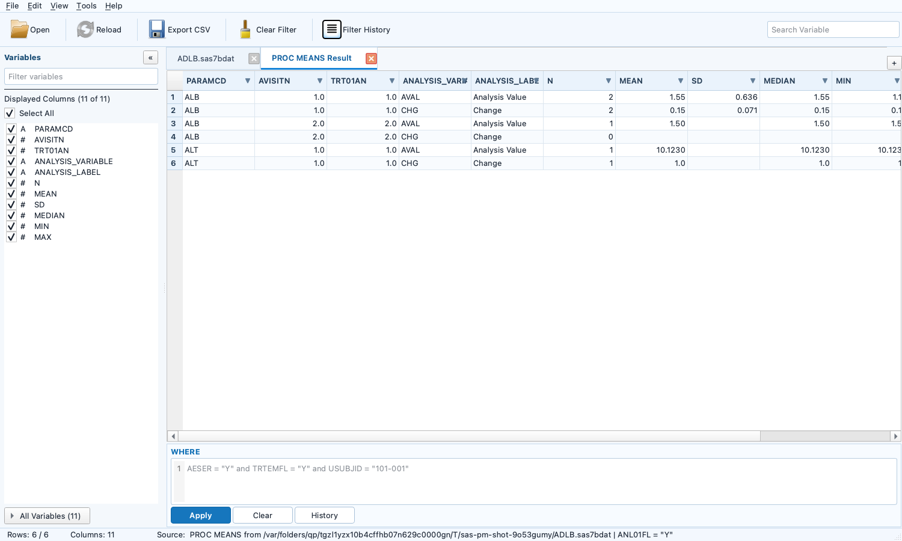
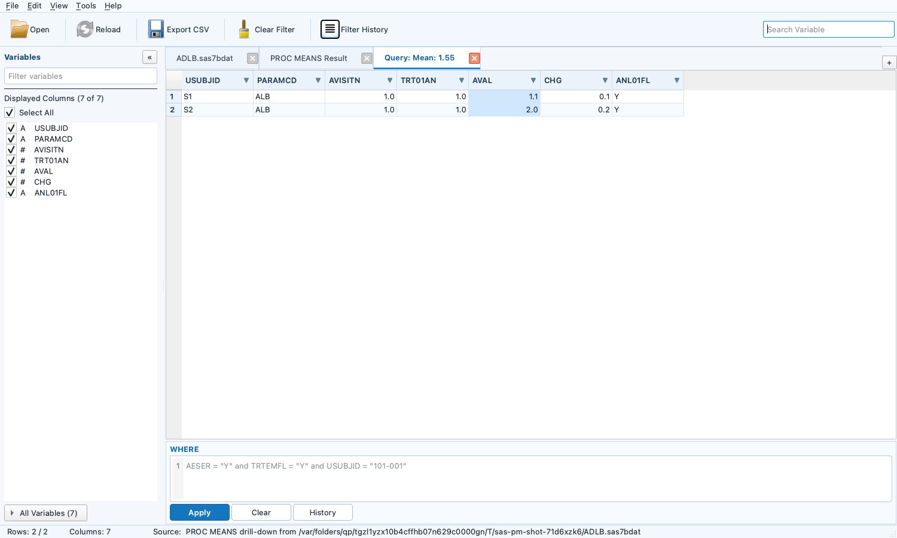
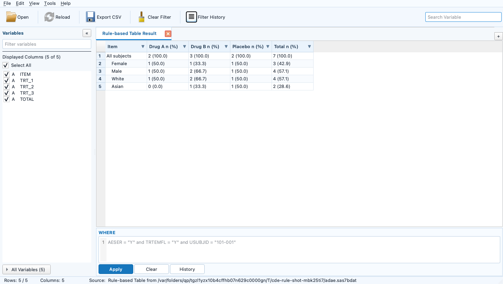
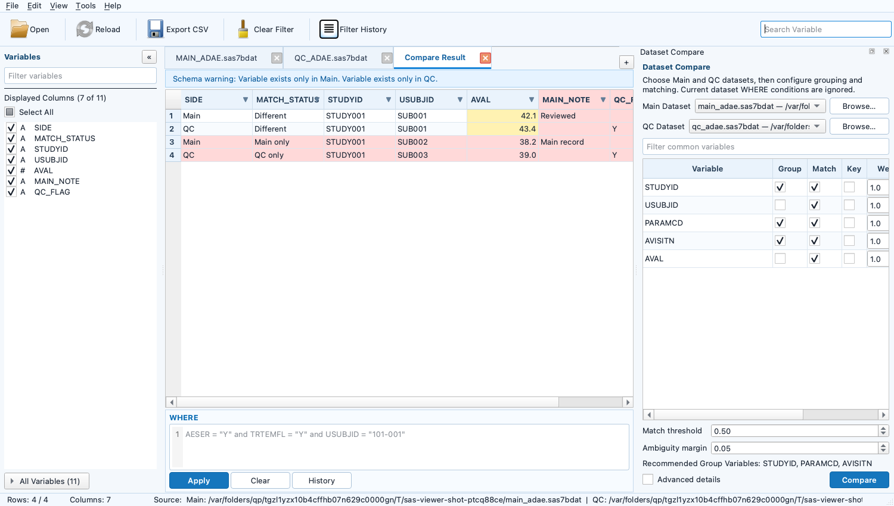

# SASDataViewer

[中文](README.md) | [English](README.en.md)

独立的 Windows 临床 SAS 数据集浏览器。它只读打开 `.sas7bdat` 和 SAS Transport `.xpt`，采用 PySide6 原生桌面界面、pyreadstat 分块读取和磁盘 SQLite 查询缓存，目标是在日常查看大数据集时保持界面响应。

## 已实现功能

- 同时打开多个 `.sas7bdat` / `.xpt`，使用可关闭、可移动的 Tab 切换。
- 源文件先分块复制到本次会话的临时目录；复制结束后，读取、筛选、排序和导出都只访问临时文件/缓存。
- 关闭 Tab 清理对应副本；退出清理整个会话；启动时清理超过 24 小时且不属于仍在运行进程的异常退出遗留目录。
- 大文件复制完成后先读取 metadata 和首批 20,000 行并显示 Tab，其余行继续在后台写入本地缓存；缓存期间仍可浏览首批及随后到达的数据。
- `QTableView + QAbstractTableModel` 虚拟行模型，每页默认 500 行、内存中只保留有限页面；可以直接滚动/跳到远端页面，不需要先加载前面的所有行。
- 可折叠 Variables 面板、显示列勾选、Select All、变量定位、变量搜索，以及 Variable/Label/Type/Length/Format metadata。
- 手写 SAS-like WHERE；支持列与常量或列与列比较，例如 `AESTDTC <= AEENDTC`。
- 比较符支持 `=`/`EQ`、`!=`/`^=`/`~=`/`<>`/`NE`、`>`/`GT`、`>=`/`GE`、`<`/`LT`、`<=`/`LE`，以及字符前缀修饰符 `=:` 等。
- 逻辑与条件支持 `AND`/`&`、`OR`/`|`/`!`、`NOT`/`^`/`~`、`IN`、`NOT IN`、`BETWEEN ... AND ...`、`CONTAINS`/`?`、`LIKE`、`IS NULL`、`IS MISSING`、`MISSING()` 和括号。
- `Ctrl+Enter` 或 Apply 执行；语法/类型/变量错误会指出原因和位置，并保留输入。
- 成功 WHERE 历史持久化；支持当前数据集/全部数据集、回填、单条删除和清空。列头互动筛选会同步生成可编辑的 SAS-like WHERE，并与手写条件作为一条完整条件保存。
- CSV 仅导出“当前筛选结果 + 当前显示列”，并保持当前排序；编码为 UTF-8 BOM，后台分批写出。存在手工行高亮时会额外增加 `HIGHLIGHT` 列记录颜色名称，因为 CSV 本身不能保存单元格背景色。
- 列头右侧的筛选箭头提供 Excel 风格互动筛选：可搜索/勾选当前值，也可按 `=`、`!=`、大小比较、Between 和 Contains 设置条件。不同列之间按 AND 组合，并与手写 WHERE 一起生效；完整条件会同步到 WHERE 编辑框，蓝色筛选标签可逐列清除。
- 数值列右键提供 `PROC MEANS (Simple)`；`Tools > PROC MEANS Builder` 支持多 Analysis/BY/CLASS、NWAY missing group、long-format 临时结果 Tab、配置 JSON，以及 SAS / R Code Generator。两种模式均使用当前完整筛选结果。
- `Tools > Categorical Table Builder` 可生成分类变量 treatment `n (%)` 临时结果 Tab，支持 Population N（固定 ADSL）、Non-missing N 和 Baseline + Postbaseline n1 三种分母、Total 和单元格 drill-down。
- `Tools > Rule-based Table Builder` 可按多条 Item/Row Filter 生成 distinct `USUBJID` 的临床 `n (%)` 宽表，第一版支持 Population N、Non-missing N 和 Same-universe 三种独立分母，并可从 `View > Open Rule-based Long Result` 打开长表。
- Settings 可为每项统计量设置相对观测基础精度的 `+0～+4`，最终最多 4 位；表格与 CSV 使用相同 `ROUND_HALF_UP` 显示值，底层 SQLite 保留完整精度。
- 在行号区域用 `Ctrl+click` 可非连续选择 2–20 行，然后右键 Compare Selected Rows；程序比较所有变量，只在参与比较的行中用浅黄色标出有差异的单元格，并在右侧 Analysis > Row Comparison 列出各行值。
- `Tools > Compare Datasets` 打开右侧比较面板；Main/QC 可从已打开 Tab 选择，也可 Browse 新的 `.sas7bdat` / `.xpt`。按 Group Variables 分组，以带权 Match Variables、数值 tolerance、Hungarian 全局一对一匹配、threshold 和 ambiguity margin 确定 observation 对应关系；Key Variables 只控制正式差异输出。结果写入会话临时 SQLite，以 Main/QC 相邻行的新 Tab 展示并高亮差异单元格，不生成 SAS 文件。
- `Tools > Merge Datasets` 打开两数据集 Merge 面板；从已完成缓存的 Tab 选择 Left/Right，按一个或多个共同 BY Variables 执行 Left/Right/Inner/Full Join。运行前严格检查 BY 类型并检测 many-to-many，结果写入独立会话临时 SQLite，保留 `_MERGE_STATUS`、`_LEFT_SOURCE_ROW`、`_RIGHT_SOURCE_ROW` 来源追踪列，不应用输入 Tab 的 WHERE。
- Merge Result 保持 `kind="merge"`，但可继续作为 PROC MEANS、Categorical Table、Rule-based Table 和后续 Merge 的 analysis source；其他临时结果不会自动进入这些 source selector。
- `Ctrl+F` 在当前筛选、排序结果的当前显示列中查找文本；`F3`/`Shift+F3` 查找下一个/上一个；`Ctrl+G` 按当前结果行号跳转。
- Reload 从原始路径生成新副本，并尽量保留显示列、WHERE 输入和已应用筛选；大文件重新缓存完成后再应用 WHERE。
- 文件复制、SAS 读取、缓存构建、查询筛选、Reload 和 CSV 导出均通过 Qt 线程池运行。

界面采用紧凑的传统 Windows 桌面布局：菜单栏、图标工具栏、数据集 Tab、左侧 Variables、右侧数据表、底部 WHERE、最底部状态栏。左侧 Filter variables 与右上角 Search Variable 同步。


## 文档导航

| 目的 | 章节 |
| --- | --- |
| 日常打开、浏览、筛选和导出数据 | [用户使用说明](#用户使用说明) |
| 运行自动化测试、真实数据验收和检查文件锁定 | [系统测试与打包](#系统测试与打包) |
| 构建 Windows EXE 和 ZIP | [Windows ZIP 打包](#windows-zip-打包) |
| 查看模块设计和项目文件 | [项目结构](#项目结构) |

## PROC MEANS 模块

PROC MEANS 用于查看当前数据子集中的数值型变量统计结果。它只做只读分析，不修改原数据，也不会把结果写回 SAS7BDAT。当前提供 Simple 和 Builder 两种模式。

### 打开方式

简约模式：

1. 在数值型列的单元格或表头上点击右键。
2. 选择 `PROC MEANS (Simple)`。
3. 单变量结果立即显示在右侧 `Analysis > PROC MEANS (Simple)` 面板。

完整模式：从 `Tools > PROC MEANS Builder` 打开 Builder。Analysis、BY 和 CLASS Variables 均可输入变量名并按 Enter 连续添加；变量名不存在时会给出错误，Analysis Variables 只允许 numeric。

Simple 保持原有的一列一键计算体验，非数值型变量自动禁用。Builder 支持多个 Analysis、BY 和 CLASS Variables，Run 后生成 long-format 临时 `PROC MEANS Result` Tab。Analysis 侧边栏按需打开 Simple、Builder 或 Row Comparison；不会预先显示未使用的模块。每个已打开模块都有独立关闭按钮，重复调用同一模块只会切换到已有 Tab。


### 计算范围

统计基于当前 Tab 的完整筛选结果，包括：

- 手写 WHERE。
- 表头互动筛选。
- 两者组合后的最终条件。

当前显示列不会改变统计范围；计算在后台线程执行，不阻塞主界面。筛选条件发生变化后，旧统计结果会标记为需要重新计算。

Builder 使用启动 Run 时已经成功应用的完整筛选快照。BY 和 CLASS 在配置中分开保存，底层共同参与分组；CLASS 采用 NWAY，只输出完整 combination，不生成 subtotal 或 `_TYPE_`。BY/CLASS 的 missing group 均保留。结果 Tab 复用 Variables、WHERE、Filter History、表头筛选、排序、查找、复制和 CSV，关闭后自动清理临时 SQLite。

### 统计量

- `n (Subjects)`：分析变量非缺失且固定变量 `USUBJID` 非缺失的唯一受试者数。
- `N (Values)`：分析变量的非缺失 observation 数。
- `NMISS`：分析变量的缺失 observation 数。
- Mean、SD、SE。
- Median、Q1、Q3，分位数采用 SAS `QNTLDEF=5` 规则。
- Min、Max。
- 均值的 Student-t 置信区间 LCLM、UCLM。

如果数据集中不存在 `USUBJID`，受试者数显示为不可用，不会自动改用其他变量。这里的小写 `n` 不是 observation 数，`N` 才是非缺失数值条数。

### PROC MEANS Settings

从数值列右键选择 `Settings…`，或者打开 `Tools > Settings`：

- 选择需要显示的统计量。
- 设置置信水平。
- 分别设置 Mean、SD、SE、Median、Q1、Q3、Min、Max、LCLM、UCLM 在观测基础精度上增加 `+0～+4` 位。
- 最终小数位为 `min(观测基础小数位 + 统计量增量, 4)`。
- Simple 的基础精度来自当前筛选后该分析变量的非缺失值。
- Builder 可以从已选择的 BY/CLASS Variables 中勾选零个、一个或多个 Decimal Group Variables；基础精度按 `Analysis Variable + 完整 Decimal Group 组合` 独立计算。例如选择 `PARAMCD + AVISIT` 后，不同 PARAMCD/AVISIT combination 可以使用不同基础精度。

显示和 CSV 都采用同一套 `ROUND_HALF_UP` 规则并保留尾随零；SQLite 仍保存完整精度 REAL，因此数值 WHERE 和排序不受显示格式影响。n、N、NMISS 始终按整数显示。SAS numeric 不保存录入时的尾随零，基础精度根据读取后的实际非缺失数值推断并忽略浮点尾差。

### Builder 配置 JSON

Builder 在生成结果 SQLite 的同一后台任务中写入 `proc_means_config.json`。它与结果位于同一会话临时目录，关闭结果 Tab 后一起清理。JSON v3 是 SAS 与未来 R/Python Generator 共用的唯一业务配置，不为每种语言复制一份 JSON。

计算契约以已经通过测试的 Python 引擎 `python_proc_means_v1` 为基准，不以尚未完成真实运行验收的 SAS code 为基准。JSON 保存原始路径、变量 metadata、Python WHERE parser 的 AST、Analysis/BY/CLASS、Statistics、Python 统计语义、动态小数位规则以及轻量的 target 配置；不保存 Viewer temp 路径或某个 parameter 已经解析好的固定小数位。

核心配置示例：

```json
{
  "type": "proc_means",
  "version": 3,
  "input": {
    "format": "sas7bdat",
    "dataset": "ADLB",
    "source_path": "C:\\project\\data\\ADLB.sas7bdat",
    "source_directory": "C:\\project\\data"
  },
  "variables": {
    "USUBJID": {
      "type": "character",
      "label": "Unique Subject Identifier",
      "length": 20,
      "format": ""
    },
    "PARAMCD": {
      "type": "character",
      "label": "Parameter Code",
      "length": 8,
      "format": ""
    },
    "AVAL": {
      "type": "numeric",
      "label": "Analysis Value",
      "length": 8,
      "format": "8.2"
    },
    "ANL01FL": {
      "type": "character",
      "label": "Analysis Record Flag 01",
      "length": 1,
      "format": ""
    }
  },
  "filter": {
    "language": "sas_like",
    "text": "ANL01FL = \"Y\"",
    "ast": {
      "type": "comparison",
      "variable": "ANL01FL",
      "operator": "=",
      "operand": {
        "type": "literal",
        "value_type": "character",
        "value": "Y"
      },
      "prefix": false
    }
  },
  "analysis_variables": ["AVAL"],
  "by_variables": ["PARAMCD"],
  "class_variables": [],
  "statistics": ["N", "MEAN", "SD", "MEDIAN", "MIN", "MAX"],
  "calculation": {
    "reference_engine": "python_proc_means_v1",
    "mean_method": "python_math_fsum",
    "sd_method": "sample_n_minus_1",
    "quantile_method": "python_qntldef5_v1",
    "confidence_interval_method": "student_t_two_sided",
    "confidence": 0.95,
    "include_missing_class": true,
    "subject_count": {
      "variable": "USUBJID",
      "distinct": true,
      "requires_nonmissing_analysis": true,
      "requires_nonmissing_subject": true
    }
  },
  "output": {
    "layout": "long",
    "numeric_values": "full_precision",
    "display_values": "formatted"
  },
  "display": {
    "decimal_group_variables": ["PARAMCD"],
    "decimal_inference": {
      "mode": "runtime_from_filtered_input",
      "reference_engine": "python",
      "method": "observed_decimal_places_v1",
      "aggregate": "maximum",
      "maximum_decimals": 4
    },
    "decimal_offsets": {"MEAN": 1, "SD": 2},
    "rounding": {
      "mode": "half_up",
      "preserve_trailing_zeros": true
    }
  },
  "targets": {
    "sas": {
      "source_library": "analysis",
      "source_member": "adlb",
      "output_dataset": "work.proc_means_result"
    },
    "r": {
      "output_object": "proc_means_result"
    }
  }
}
```

### SAS / R Code Generator

在 Builder 中完成变量、Statistics 和 Decimal Group Variables 配置后，可直接点击 `SAS Code Generator…` 或 `R Code Generator…`，无需先 Run。两个 Generator 都使用与结果 JSON 完全相同的 v3 serializer，通过 Jinja2 生成只读预览；预览窗口支持 Copy 和 Save As `.sas` / `.R`。WHERE 均由保存的 Python Filter AST 渲染，而不是重新猜测原始文本。

生成的程序会：

- 从原始 SAS7BDAT 所在目录建立小写 `analysis` library，不引用 Viewer temp copy。
- 应用 Builder 当前 Filter，并分别保留 BY 与 CLASS 配置；CLASS 使用 NWAY/missing。
- 源成员名从当前数据集动态取得并以小写渲染，例如 `analysis.adlb` 或 `analysis.adae`，不写死 ADLB；非标准名称使用 SAS name literal。
- 生成 long-format `work.proc_means_result`，`SUBJECT_N` 固定按非 missing `USUBJID` 去重。
- 临时 Work 表使用来源数据集前缀和小写可读名称，例如 ADLB 会生成 `work.adlb_source`、`work.adlb_aval_stats`、`work.adlb_aval_subjects`、`work.adlb_aval_long` 和 `work.adlb_decimal_rules`；长变量名会安全截短并去重。变量名仍保留源数据集的真实大小写。
- 使用 `VARDEF=DF`、`QNTLDEF=5` 和设置中的 confidence/alpha。
- 在 SAS 每次实际运行时，按 `Analysis Variable + 完整 Decimal Group combination` 从最新数据重新推断基础小数位，再应用各统计量 `+0～+4`、最多 4 位的显示规则。

R Generator 只依赖 `haven`：对 `.sas7bdat` 使用 `haven::read_sas()`，对 `.xpt` 使用 `haven::read_xpt()`；输出 R 环境中的 `proc_means_result` long-format data frame。它复用 Python 的筛选 AST、BY/CLASS 完整分组、missing 处理、`QNTLDEF=5` 分位数、样本 SD、Student-t CI、固定 `USUBJID` subject n，以及按最新筛选数据动态推断的小数位和 half-up 显示列。它不会引用 Viewer temp copy，也不会执行或写入任何外部文件。首次在 R 环境运行前执行一次 `install.packages("haven")` 即可。

预览只生成和保存代码，SASDataViewer 不执行 SAS 或 R 程序。SAS 专用 Jinja2 模板位于 `clinical_data_viewer/codegen/sas/templates/`；R 专用模板位于 `clinical_data_viewer/codegen/r/templates/`，两者读取同一份 JSON v3，不单独维护另一份业务 JSON。




### Drill-down Query Tab

在 `PROC MEANS Result` 中双击统计值，或右键选择 `Drill Down to Source Rows`，程序会在后台生成一个新的只读临时 Tab，例如 `Query: Mean: 81.5`。它不会修改原数据集 Tab 的 WHERE、排序或浏览位置。

Query 不是在原始数据中搜索 81.5；Mean 等汇总值可能并不存在于任何一条源记录。程序根据结果行的 Analysis Variable、完整 BY/CLASS combination，以及运行 Builder 时保存的筛选快照确定参与记录：

- N、Mean、SD、SE、Median、Q1、Q3、Min、Max、LCLM、UCLM 显示分析变量非 missing 的参与记录。
- NMISS 只显示分析变量 missing 的记录。
- n (Subjects) 显示分析变量和固定 `USUBJID` 均非 missing 的记录；同一受试者的多条源记录仍全部展示。

Query Tab 复用 Variables、WHERE、表头筛选、排序、查找、复制和 CSV，并自动定位 Analysis Variable。它从生成 PROC MEANS 时的源 SQLite 快照复制所需的小范围记录，因此即使随后关闭或 Reload 原数据集显示 Tab，也不会改变已生成的 Query；关闭 Query 后自动清理。



### PROC MEANS 限制

- Compare Result 和 PROC MEANS Result Tab 中禁用 PROC MEANS，避免对派生结果重复分析。
- SAS / R Code Generator 只生成程序文本；Viewer 本身不生成实体 SAS 或 R 结果文件。
- 不执行 SAS 或 R 程序。
- pyreadstat 读取的原始数值和 SAS format 后的显示值可能不同，正式统计输出仍应由经过验证的 SAS 程序生成。

## Categorical Table 模块

从 `Tools > Categorical Table Builder` 打开右侧 Analysis 面板。选择一个或多个 Item、treatment variable、subject ID、计数方式和百分比小数位，并填写独立的 `Numerator WHERE`；打开 Builder 时它默认继承当前 source tab 的 WHERE，但后续编辑不会改变 source tab。再选择分母策略；Run 在后台生成可筛选、排序、选择显示列和导出 CSV 的 `Categorical Table Result` Tab。默认结果采用临床表格样式：第一列 `Item / Level` 中每个 Item 为加粗标题行，Level 缩进显示，treatment 与 Total 横向展开为 `freq (percent)`。

| 分母 | 数据来源与口径 |
| --- | --- |
| Population N | 分子使用 source + Numerator WHERE；分母只使用用户打开或 Browse 的 ADSL + Population WHERE。treatment、subject ID 和 context variables 均由用户选择，Total 基于总体 ADSL population 重新计算。 |
| Non-missing N | 当前分析数据集 + Numerator WHERE，再按指定 analysis value 非缺失的记录/受试者计算。 |
| Baseline + Postbaseline n1 | 当前分析数据集 + Numerator WHERE，再叠加用户提供的 baseline 与 postbaseline WHERE。只有同一 treatment/context/subject 同时满足两项且 analysis value 有效的 postbaseline 记录进入 n1。n1 固定使用 record count，不去重。 |

Item 可分别设置 context/group variables，例如 `PARAMCD + AVISIT`，以及是否展示 `(Missing)` level。Population N 使用 distinct subject 是临床表格的默认选择；若改为 record count 且 ADSL 并非每受试者一条记录，百分比可能超过 100%，Builder 会明确显示该计数口径。

同时会在同一会话 SQLite 中保存权威 long-format 结果：`ITEM`、`ITEM_LABEL`、context variables、`LEVEL`、`TRT`、`FREQ`、`DENOM`、`PCT`。在默认 Result Tab 激活时，可用 `View > Open Categorical Long Result` 打开独立的长表 Tab；它同样支持 WHERE、列选择、排序和 CSV。双击默认结果中的 `n (%)` 单元格可选择查看 Numerator Records、Numerator Subjects 或 Denominator Subjects，生成独立的临时 Query Tab。关闭 Categorical Result Tab 不会清空 Builder 配置；只有点击 Builder 底部 `Clear` 才会清除 Item、WHERE、分母和表格设置。所有结果、Query 和 ADSL/source 缓存仅在会话中保留；关闭结果 Tab 会清理对应临时 SQLite。当前版本不提供 Categorical JSON 保存/加载，后续会在配置界面稳定后补充。

## Rule-based Table 模块

从 `Tools > Rule-based Table Builder` 打开规则表 Builder。它适合把多条临床规则整理成 `n (%)` 结果：每一行包含一个 Item、可选的 WHERE 条件、缩进级别和固定的 `distinct USUBJID` 计数。Dataset-level Filter 会默认继承当前数据集 Tab 的 WHERE，但 Builder 中的修改不会改变源 Tab。

第一版支持三种独立分母：

| 分母 | 计算范围 |
| --- | --- |
| Population N | 分子使用 source + Dataset Filter + Row Filter；分母只使用打开或 Browse 的 ADSL + Population WHERE。两套 WHERE 不会互相套用。 |
| Non-missing N | source + Dataset Filter，并在指定 Analysis Value 非缺失的受试者范围内计算分母。 |
| Same-universe N | source + Dataset Filter 的 treatment universe；不会把某条规则的 Row Filter 错误地用于分母。 |

Treatment 缺失时计算会被阻止，并列出发生缺失的 Rule row 及记录数；用户修改 Dataset Filter 或 Row Filter 后才能重新运行。结果写入会话临时 SQLite，不生成 SAS 文件，生成后可像普通数据集一样分页浏览、WHERE 筛选、排序、选择列、复制、CSV 导出和双击单元格钻取 Numerator Records / Numerator Subjects / Denominator Subjects。默认结果是临床宽表；选择 `View > Open Rule-based Long Result` 可打开同一结果的长表 Tab。关闭结果 Tab 后会清理结果及其保留的 source/ADSL 临时缓存。

每个成功的 Rule-based Result 临时目录同时保存 `dataset.sqlite` 和 `rule_based_config.json`。JSON 使用固定的 Rule-based Table configuration v1，记录输入数据集、完整变量 metadata、Dataset/Row/Population Filter 的文本与 Filter AST、distinct `USUBJID`、resolved treatment 顺序、分母、Total、百分比及显示舍入语义。它是未来 SAS Generator 的唯一业务配置来源；当前版本尚未实现 Rule-based SAS/R Code Generator。Merge Result 会明确保存为 `input.kind="merge"`，不会伪装成真实 SAS 文件。



## Dataset Compare 模块

Dataset Compare 用于比较 Main 和 QC 两个 SAS 数据集，寻找对应 observation，并把存在差异或匹配异常的记录生成一个临时 Compare Result Tab。比较过程不会生成实体 SAS 文件，也不会修改 Main/QC 数据。



### 打开和选择数据集

从 `Tools > Compare Datasets` 打开右侧面板，然后选择：

- `Main Dataset`：主数据集。
- `QC Dataset`：QC 数据集。

每一侧都可以：

- 从已经打开的普通数据集 Tab 中选择。
- 点击 `Browse…` 从文件夹选择新的 `.sas7bdat`。

Browse 使用与 Open 相同的安全流程：先把源文件复制到程序临时目录，再读取副本并作为普通 Tab 打开。完整缓存完成后才能开始 Compare，原始文件随后仍可由 SAS 覆盖、删除或重新生成。

Compare 始终读取 Main/QC 的完整原始缓存，忽略两个输入 Tab 当前的 WHERE、表头筛选、排序和显示变量。

### Compare Variables

右侧共同变量列表提供以下配置：

- `Group`：先按相对稳定的变量分组，例如 `USUBJID + PARAMCD`。只在相同 group 内寻找对应 observation。
- `Match`：用于计算组内每个 Main×QC observation 组合的匹配成本。
- `Key`：只控制正式 Diff 输出，不用于强制 observation 匹配。
- `Weight`：Match Variable 的权重；越稳定的变量可以设置越高权重。
- `Tolerance`：数值型 Match Variable 的允许误差。

如果共同变量中存在 `USUBJID` 或 `PARAMCD`，界面默认把它们选为 Group Variables，其余共同变量默认选为 Match Variables，用户可以修改。

### Observation 匹配规则

1. 按 Group Variables 对 Main/QC 分组。
2. 对同一 group 内所有 Main×QC 组合计算归一化匹配成本。
3. missing 对 missing 视为相同；missing 对非 missing 视为不同。
4. 字符变量按原值区分大小写比较。
5. 数值变量差值不超过 tolerance 时视为相同。
6. 使用 `scipy.optimize.linear_sum_assignment` 执行 Hungarian 全局一对一匹配，避免同一 observation 被重复使用。
7. 虚拟 unmatched 节点参与全局优化，算法可以主动拒绝明显不同的配对。
8. 成本超过 `Match threshold` 的 observation 标记为 Unmatched。
9. 最佳与第二候选的成本差不超过 `Ambiguity margin` 时标记为 Ambiguous。

选择 Main/QC 且两侧完整缓存就绪后，程序会在后台自动推荐最多 3 个 Group Variables。候选变量必须同名（不区分变量名大小写）、类型兼容，并且两侧标准化后的每个 `value + frequency` 完全一致；字符值区分大小写，missing 的频数也必须一致，常量变量同样可以成为候选。最终推荐组合的联合频数也必须完全一致。Match Variables 默认全选全部可比较共同变量，Key Variables 默认不选。

`AVISITN`、`ASEQ` 等变量可以作为 Match Variables，但不会被直接当作唯一 key；匹配完成后，这些变量仍会和其他共同变量一起执行真正的逐变量比较。

### Key Variables 规则

- 没有选择 Key Variables：比较并输出所有共同变量的差异。
- 选择了 Key Variables，且 key 有差异：只把发生差异的 key 标记为正式差异。
- 选择了 Key Variables，且 key 完全一致：继续比较并标记其他共同变量差异。
- Key Variables 不参与强制 observation 匹配。
- Main only、QC only、Unmatched 和 Ambiguous 不会被 Key Variables 隐藏。

### Compare Result

Compare Result 写入本次会话的临时 SQLite，并作为普通数据 Tab 打开。只保留以下结果：

- `Different`：已经匹配，但存在正式变量差异。
- `Main only`：对应 group 或 observation 只存在于 Main。
- `QC only`：对应 group 或 observation 只存在于 QC。
- `Unmatched`：两侧存在相同 group，但没有低于 threshold 的可靠配对。
- `Ambiguous`：存在多个成本非常接近的候选，不能可靠确定唯一对应关系。

匹配成功的 observation 使用相同 `COMPARE_PAIR`，并始终按以下顺序相邻显示：

```text
Main
QC
```

结果还包含 `SIDE`、`MATCH_STATUS`、`SOURCE_OBS` 和 `DIFF_VARIABLES`。正式差异变量在 Main/QC 两行的对应单元格中同时使用浅黄色高亮；`Main only`、`QC only` 和 `Unmatched` 整行使用淡红色警告；完全一致的匹配 observation 不进入结果。

只存在于 Main 或 QC 的变量仍保留为结果列：存在的一侧显示原值，另一侧留空，整列和表头使用淡红色，并在 tooltip 中说明所属侧。仅有 schema 差异不会让原本完全一致的 observation 强制进入结果；即使结果为 0 行，警告列和 schema 提示仍会保留。

面板底部的 `Advanced details` 可按 Compare Result 单独显示 `COMPARE_PAIR`、`MATCH_COST` 和 `MATCH_MARGIN`。关闭时这些字段不会出现在表格和 Variables 面板；无论是否显示，CSV 始终排除这三个内部诊断字段。

### Compare Result 浏览和导出

Compare Result 复用普通 Dataset Tab 的以下能力：

- Variables 面板、Select All、显示列选择和变量定位。
- 手写 WHERE 和 Filter History。
- 表头互动筛选。
- 排序、Ctrl+F、Ctrl+G。
- 单元格、整行和区域复制。
- CSV 导出当前筛选结果、当前显示列和当前排序。
- 双击黄色差异单元格或淡红色警告行的数据单元格，可跳转到对应 Main/QC 源 Tab 的原 observation 和变量；隐藏列会自动恢复。若源 WHERE 隐藏了该 observation，程序会先询问是否清除源筛选。源 Tab 已关闭或在比较后 Reload 时不会跳转到可能已经变化的数据。

筛选和排序按 `COMPARE_PAIR` 处理：Main 或 QC 任意一行满足 WHERE/表头筛选时保留整个匹配对；排序只改变匹配对之间的顺序，每组内部始终保持 Main 在前、QC 在后。Main only/QC only 等单边结果保持一行。

### 临时文件和安全限制

- Compare Result 不生成 SAS7BDAT，关闭结果 Tab 后自动删除对应临时 SQLite。
- Compare Result 禁用 Reload、PROC MEANS 和再次作为 Dataset Compare 输入。
- Main/QC 完整缓存未完成时不能开始比较。
- 单个相同 group 默认最多允许 2,000 条 Main+QC 记录和 1,000,000 个候选组合；超过限制会指出具体 group 并停止，而不会让界面因超大 cost matrix 长时间无响应。
- Dataset Compare 在 Qt 后台线程运行，不阻塞主界面。

## 用户使用说明

### 启动程序

源码运行需要 64 位 Python 3.11 或更新版本。项目只声明下限 `>=3.11`，没有把 3.11.5、3.12 或某个最高版本写死。普通用户直接运行打包后的 `SASDataViewer.exe`，不需要安装 Python 或 SAS。

```powershell
cd C:\path\to\sas7bdat-viewer
python -m venv .venv
.\.venv\Scripts\Activate.ps1
python -m pip install -r requirements.txt
python -m clinical_data_viewer
```

运行不依赖 SAS，也不会执行 SAS 程序。pyreadstat 对自定义 format catalog、特殊 missing、编码和某些日期显示方式可能与 SAS 本身不同；本工具定位为只读日常浏览器，不用于监管输出计算。

### 常用操作

#### 打开、浏览和列管理

| 功能 | 操作 | 说明 |
| --- | --- | --- |
| 打开数据集 | `Open`；可一次选择多个 `.sas7bdat` / `.xpt` | 每个数据集进入一个独立 Tab。 |
| 直接打开 | 命令行运行 `SASDataViewer.exe "C:\project data\中文\adae.sas7bdat"`，或双击已关联的 `.sas7bdat` / `.xpt` 文件 | 支持空格、中文路径；当前版本采用多实例方式。 |
| 排序 | 点击列名；再次点击切换升序/降序 | 相同值按源行顺序稳定显示。 |
| 选择显示列 | Variables 面板勾选变量 | `Select All` 可在全选/全不选之间切换；再次点击可恢复全部变量。 |
| 查看 metadata | 展开 `All Variables` | 可查看 Variable、Label、Type、Length、Format。 |
| 复制 | 选择单元格、整行或区域后按 `Ctrl+C` | 右键也可复制列名。 |

#### 筛选、查找和定位

| 功能 | 快捷键/入口 | 说明 |
| --- | --- | --- |
| 手写 WHERE | 底部 WHERE 编辑框、`Apply`、`Ctrl+Enter` | 支持 SAS-like 比较、列对列比较、`IN`、`BETWEEN`、`CONTAINS`、`LIKE`、missing 和逻辑运算。错误会保留原输入。 |
| 表头互动筛选 | 点击表头最右侧 `▼` | 支持 Values、Missing、数值 Between 和字符 Contains；条件会同步写入 WHERE。 |
| 精确值筛选 | 在列筛选搜索框输入完整值，例如 `ALB` | 生成 `PARAMCD in ("ALB")`，不会自动变成 `not missing(PARAMCD)`。 |
| 文本查找 | `Ctrl+F`、`F3`、`Shift+F3` | 只查当前筛选结果和当前显示列。 |
| 跳转行号 | `Ctrl+G` | 输入当前结果中的 1-based 行号。 |
| 历史条件 | `Filter History` | 可恢复、删除和清空已成功执行的 WHERE；回填后需要 Apply。 |
| 清除筛选 | `Clear Filter` 或 `Clear` | 只恢复显示，不修改原始数据。 |

#### 分析、比较和导出

| 功能 | 操作 | 说明 |
| --- | --- | --- |
| PROC MEANS Simple | 数值列右键 → `PROC MEANS (Simple)` | 查看当前筛选结果的 n、N、均值、分位数和 CI。 |
| PROC MEANS Builder | `Tools > PROC MEANS Builder` | 配置多个 Analysis/BY/CLASS、Decimal Group Variables，生成临时结果 Tab。 |
| Categorical Table | `Tools > Categorical Table Builder` | 配置多个分类 Item、treatment、分母、Total 和百分比小数位，生成 `n (%)` 临时结果 Tab。 |
| SAS/R 代码 | Builder 中点击 `SAS Code Generator…` 或 `R Code Generator…` | 生成代码预览，不执行 SAS/R。 |
| 行比较 | 按住 `Ctrl` 选择多个行号 → 右键 Compare | 只高亮选中行中有差异的列。 |
| 数据集比较 | `Tools > Compare Datasets` | 选择 Main/QC，生成临时 Compare Result Tab；支持筛选、排序、源行跳转和 CSV。 |
| 数据集合并 | `Tools > Merge Datasets` | 选择 Left/Right、共同 BY 和四种 Join，检测类型/重复 key，生成带状态与来源行的临时 Merge Result Tab。 |
| 导出 CSV | `Export CSV` | 导出当前筛选结果、当前显示列和当前排序；使用 UTF-8 BOM。 |
| 重新加载 | `Reload` | 从原始路径重新生成临时副本，并尽量保留 WHERE 和显示列。 |

大文件的完整缓存尚未完成时，表格会显示蓝色提示和 `Rows cached` 状态。此阶段允许浏览、复制和调整显示变量；筛选、排序、全文查找、行跳转和 CSV 导出会暂时禁用，因为这些操作必须基于完整数据才不会产生误导结果。缓存完成后自动启用，无需重新打开文件。

### 数据与临时文件

Windows 默认目录：

```text
%LOCALAPPDATA%\ClinicalDataViewer\temp\cde-<time>-<pid>-<id>\<dataset-id>\
```

`TempManager.copy_dataset()` 对源文件使用局部 `with open(..., "rb")`。句柄在复制完成或失败时立即关闭；后续 pyreadstat 只打开临时副本。因此加载完成后 SAS 可以覆盖、删除或重新生成源文件。Reload 会再次短暂打开源文件并创建一份新的、完整缓存；成功后再淘汰旧副本。

历史和设置位于：

```text
%LOCALAPPDATA%\ClinicalDataViewer\filter_history.sqlite
%LOCALAPPDATA%\ClinicalDataViewer\settings.json
```

历史仅保存原始路径、文件名、WHERE 和 UTC 时间，不保存任何数据行。

## Merge Datasets 模块

从 `Tools > Merge Datasets` 打开右侧面板。选择两个已经打开且完成缓存的数据集作为 Left 和 Right，再勾选两侧共同存在的一个或多个 BY Variables。输入数据集的当前 WHERE、列筛选、排序和显示列都会被忽略；Merge 始终使用两个完整缓存。

| 配置 | 说明 |
| --- | --- |
| Join Type | `Left Join`、`Right Join`、`Inner Join`、`Full Join`。 |
| BY Variables | 只列出两侧共同变量；多个变量按完整组合匹配。变量类型必须兼容，字符/数值不自动转换。 |
| Sort by | 可按最终结果列添加多个排序变量；按 Enter 确认后可继续添加，默认 `ASC`，每项可改为 `DESC`，并可调整优先级或删除。未设置时使用稳定 source-row 顺序。 |
| 同名变量 | BY 变量只保留一份；非 BY 的 Right 同名变量使用稳定的 `_RIGHT` 后缀，必要时追加 `_2`。 |
| Missing BY | 缺失值不与另一侧缺失值匹配；字符空字符串和空白也按 missing 处理。 |
| Many-to-many | 运行前统计两侧重复 key；若同一 key 两侧都重复，会弹出警告，用户确认后才继续。 |

结果以 `Merge Result - Left + Right` 临时 Tab 打开，复用普通 Viewer 的 Variables、WHERE、表头筛选、排序、复制和 CSV 导出。结果还会保留：

- `_MERGE_STATUS`：`MATCHED`、`LEFT_ONLY` 或 `RIGHT_ONLY`。
- `_LEFT_SOURCE_ROW` / `_RIGHT_SOURCE_ROW`：对应源缓存中的 `_source_row`，没有对应记录时为空。

结果只写入会话临时 SQLite，不修改 Left/Right，也不生成 SAS 文件。Merge Result 可以继续进入后续分析链路；关闭结果 Tab 后会在所有下游结果释放后清理对应临时缓存。

## 系统测试与打包

系统测试分为自动化检查、界面运行检查、真实数据验收和发布包验证。最终发布前应在 Windows 10/11 64 位机器上完成全部部分。

### 1. 测试环境

打开 PowerShell，进入项目目录：

```powershell
cd C:\path\to\sas7bdat-viewer
python -m venv .venv
.\.venv\Scripts\Activate.ps1
python -m pip install --upgrade pip
python -m pip install -r requirements-build.txt
```

确认运行环境：

```powershell
python --version
python -c "import PySide6, pyreadstat, jinja2; print('PySide6 OK'); print('pyreadstat', pyreadstat.__version__); print('Jinja2', jinja2.__version__)"
```

### 2. 自动化检查

```powershell
ruff check clinical_data_viewer tests run.py
ruff format --check clinical_data_viewer tests run.py
python -m compileall -q clinical_data_viewer tests run.py
python -m unittest discover -s tests -v
```

预期结果：

- Ruff 显示 `All checks passed!`。
- `compileall` 没有错误输出，并返回成功。
- 所有单元测试显示 `OK`；安装 PySide6 后 UI smoke test 不应被跳过。
- 测试覆盖 WHERE 解析和类型校验、参数化 SQL、分页筛选排序、当前视图 CSV 和 UTF-8 BOM、Filter History 恢复/去重、设置持久化、临时副本及遗留目录清理、PROC MEANS JSON v3/Filter AST/SAS 代码生成/运行时小数位，以及 Dataset Compare 的全局匹配、精确 Group 推荐、阈值拒绝、ambiguity、Key 规则、Main/QC only 分类、schema 警告、配对筛选/排序、源行定位与高级字段导出排除。

### 3. 启动检查

```powershell
python -m clinical_data_viewer
```

应看到浅蓝色 Windows 11 / SAS Studio 风格主界面。检查 Open、Reload、Export CSV、Clear Filter、Filter History、Variables 面板、WHERE 编辑器和最底部状态栏都可见。

### 4. 真实数据验收

请使用测试副本，不要直接拿唯一一份生产数据做删除测试。

1. 用 Open 同时选择 2–3 个 SDTM/ADaM `.sas7bdat`，确认每个文件生成独立 Tab。
2. 核对总行数、变量数，以及 Variable、Label、Type、Length、Format metadata。
3. 先取消 Select All，再次点击 Select All，确认全部变量能恢复；逐个勾选/取消变量，确认主表立即只显示当前变量；点击变量应定位对应列。
4. 点击表头测试升序/降序；选择单元格、整行和矩形区域后按 `Ctrl+C`。
5. 执行组合 WHERE，例如：

   ```text
   AESER = "Y" and TRTEMFL = "Y" and USUBJID = "101-001"
   ```

6. 分别验证 `IN`、`NOT IN`、`CONTAINS`/`?`、`AND`/`&`、`OR`/`|`、`BETWEEN`、`LIKE`、`IS NULL/MISSING`、比较助记符和括号。
7. 验证列对列条件，例如 `AESTDTC <= AEENDTC`，并确认字符列与数值列比较会给出明确类型错误。
8. 点击不同列的筛选箭头，分别验证 Values、Missing、数值 Between 和字符 Contains；只选 `PARAMCD=ALB` 时 WHERE 应为 `PARAMCD in ("ALB")`，不得自动追加 missing 或多余外层括号；明确勾选 Missing 后才出现小写的 `or missing(PARAMCD)`。确认状态行数、CSV、PROC MEANS 和 Filter History 都使用同一最终结果。手工修改生成条件再 Apply，确认旧蓝色筛选标签清除且条件不重复。
9. 在数值列右键运行 `PROC MEANS (Simple)`，核对当前筛选结果的受试者 n、观测 N、均值、分位数和 CI；在非数值列确认菜单禁用。确认 Analysis 只按需出现使用过的模块 Tab，每个模块可独立关闭且不会重复打开。设置 Mean=+1、SD=+2、Median=+1、Min/Max=+0，确认先按实际值推断基础精度、最终封顶 4 位且重启后恢复。再用 Builder 配置多个 Analysis/BY/CLASS、missing group 和多个 Decimal Group Variables，确认按完整 combination 推断精度、long-format 结果和 CSV 尾随零。检查临时 `proc_means_config.json` 为 v3、包含 Python Filter AST/`python_proc_means_v1`/动态小数位规则且不包含已解析的固定 parameter 小数位；生成的 SAS 使用动态小写 `analysis.<dataset>`、小写 Work 成员且不写死 ADLB。双击 Mean/NMISS 等统计值，确认新建 Query Tab 只包含对应参与记录、自动定位分析列且不改变源 Tab。
10. 在行号上用 Ctrl 非连续选择 2–20 行，运行 Compare Selected Rows；确认黄色只出现在所选行与差异列的交叉单元格，未选行不变；隐藏变量的差异仍出现在 Analysis 面板中。
11. 按 `Ctrl+F` 查找当前显示文本，并用 `F3`/`Shift+F3` 前后查找；按 `Ctrl+G` 跳到第 1 行、末行和一个远端中间行。
12. 故意输入未闭合引号、未知变量和错误类型，确认显示清楚的错误且 WHERE 原文仍保留。
13. 关闭程序再启动，确认成功执行过的 WHERE 能从当前数据集历史和全局历史恢复。
14. 分别直接运行 `.sas7bdat` 和 `.xpt` 路径，确认程序自动打开对应文件；再把两种扩展名关联到 EXE 后双击验证。文件名包含空格和中文时也应成功。
15. 从 `Tools > Compare Datasets` 选择或 Browse Main/QC；确认后台最多推荐 3 个 value+frequency 完全一致的 Group、Match 默认全选、Key 默认不选。用重复 group、交换顺序、错误 `AVISITN/ASEQ`、数值微小差异、Main/QC 独有记录和单侧变量测试。确认 Main/QC 相邻、差异单元格为黄色、Main/QC only 与 Unmatched 整行为淡红色、单侧变量整列为淡红色、完全相同 observation 不输出。双击黄色/红色数据单元格验证跳回正确源 observation；勾选 Advanced details 验证三个诊断字段出现，但 CSV 始终不导出它们。在结果 Tab 使用 WHERE、表头筛选、显示列、排序和 CSV，并确认任一侧命中筛选都会保留整对。

完整人工检查表也保存在 [docs/windows-acceptance.md](docs/windows-acceptance.md)。

### 5. 源文件锁定检查

先创建专用测试副本和备份：

```powershell
New-Item -ItemType Directory -Force .\manual-test | Out-Null
Copy-Item "C:\clinical-test\adae.sas7bdat" ".\manual-test\lock-test.sas7bdat"
Copy-Item ".\manual-test\lock-test.sas7bdat" ".\manual-test\lock-test-backup.sas7bdat"
```

在 SASDataViewer 中打开 `manual-test\lock-test.sas7bdat`，等加载完成后，在另一个 PowerShell 窗口执行：

```powershell
Remove-Item ".\manual-test\lock-test.sas7bdat"
Copy-Item ".\manual-test\lock-test-backup.sas7bdat" ".\manual-test\lock-test.sas7bdat"
```

两条命令都应成功，已打开的 Tab 仍应能浏览旧快照。这证明加载完成后程序不再持有原文件。此处删除的只是明确创建的测试副本。

### 6. Reload、CSV 和临时清理

- 修改或重新生成测试源文件，点击 Reload；确认显示新内容，并尽量保留 WHERE 和显示变量。大文件缓存完成后 WHERE 应自动重用。
- 先筛选、隐藏若干变量并排序，然后 Export CSV；确认导出的行数、行顺序和列集合与当前视图完全一致，文件开头包含 UTF-8 BOM。
- 加载过程中拖动窗口、切换其他 Tab；导出大 CSV 时继续操作界面，确认没有主线程冻结。
- 用行数超过 20,000 的数据集验证：首批行显示后 Tab 可立即浏览，底部缓存行数持续增加；缓存完成前筛选/排序/查找/跳转/导出不可用，完成后自动恢复。
- 打开文件后检查 `%LOCALAPPDATA%\ClinicalDataViewer\temp`；关闭对应 Tab 后其 dataset 子目录应消失，正常退出后本次 `cde-*` 会话目录应消失。

### Windows ZIP 打包

Windows 程序必须在 Windows 64 位环境构建；macOS 不能用 PyInstaller 直接交叉生成可用的 Windows EXE。项目使用 PyInstaller `onedir`，最终发布物是包含完整程序目录的 ZIP。目标环境建议使用已经验收的 Python 3.11.5 64 位，但构建配置没有限定到这个补丁版本。

#### 方法一：自动构建脚本（推荐）

在项目根目录打开 PowerShell：

```powershell
Set-ExecutionPolicy -Scope Process Bypass
.\scripts\build_windows.ps1
```

脚本不会写死 `py -3.12`。它优先使用当前 `python`，其次使用 Windows `py` launcher，也可以明确传入任意 Python 3.11+ 解释器而不修改脚本：

```powershell
.\scripts\build_windows.ps1 -PythonExe "C:\Path\To\Python311\python.exe"
```

如果已有 `.venv` 来自另一个 Python，需要重建时：

```powershell
.\scripts\build_windows.ps1 -PythonExe "C:\Path\To\Python311\python.exe" -RecreateVenv
```

脚本会依次：

1. 创建 `.venv`（不存在时）。
2. 安装 PySide6、pyreadstat、SciPy、Ruff 和 PyInstaller。
3. 运行 Ruff、格式、Python 编译和全部单元测试。
4. 仅在检查全部通过后构建 `onedir` GUI 程序目录。
5. 将整个 `SASDataViewer` 目录压缩为 Windows x64 ZIP。
6. 输出 EXE 和 ZIP 的完整路径、大小与 SHA256。

EXE、窗口标题栏和 Windows 任务栏图标使用 [assets/SASDataViewer.ico](assets/SASDataViewer.ico)。该文件由用户提供的 [原始 PNG](assets/SASDataViewer.png) 生成，内含 16、20、24、32、40、48、64、128 和 256 像素尺寸；正常构建无需再次手工转换图标。

生成目录和最终发布文件：

```text
dist\SASDataViewer\
  SASDataViewer.exe
  _internal\
  ...
dist\SASDataViewer-Windows-x64.zip
```

发布时发送 `SASDataViewer-Windows-x64.zip`。用户必须先完整解压，然后从解压后的 `SASDataViewer\SASDataViewer.exe` 启动；不能只复制 EXE，也不要直接在 ZIP 预览窗口内运行。

#### 方法二：手动打包

```powershell
cd C:\path\to\sas7bdat-viewer
python -m venv .venv
.\.venv\Scripts\Activate.ps1
python -m pip install --upgrade pip
python -m pip install -r requirements-build.txt
ruff check clinical_data_viewer tests run.py
ruff format --check clinical_data_viewer tests run.py
python -m compileall -q clinical_data_viewer tests run.py
python -m unittest discover -s tests -v
pyinstaller --noconfirm --clean SASDataViewer.spec
if (Test-Path .\dist\SASDataViewer-Windows-x64.zip) {
    Remove-Item .\dist\SASDataViewer-Windows-x64.zip
}
Compress-Archive -Path .\dist\SASDataViewer `
    -DestinationPath .\dist\SASDataViewer-Windows-x64.zip `
    -CompressionLevel Optimal
```

#### 打包后验证

```powershell
Get-Item .\dist\SASDataViewer-Windows-x64.zip | Select-Object FullName, Length, LastWriteTime
Get-FileHash .\dist\SASDataViewer-Windows-x64.zip -Algorithm SHA256
Expand-Archive .\dist\SASDataViewer-Windows-x64.zip .\dist\zip-test -Force
Start-Process .\dist\zip-test\SASDataViewer\SASDataViewer.exe
```

验证 EXE 能接收 Windows 文件关联传入的路径：

```powershell
& .\dist\zip-test\SASDataViewer\SASDataViewer.exe "C:\clinical test\中文\adae.sas7bdat"
```

程序本身不会静默修改注册表。请通过 Windows“打开方式 > 选择其他应用 > 始终使用此应用”分别关联 `.sas7bdat` 和 `.xpt`，或由组织的安装包注册文件关联；关联命令必须包含带引号的 `%1`，典型形式为 `"C:\path\SASDataViewer.exe" "%1"`。当前版本采用多实例行为：双击文件会新开一个 Viewer 窗口，不会转交给已经运行的窗口。

然后使用解压后的 `SASDataViewer.exe` 重复上面的真实数据、源文件占用、历史恢复、筛选导出、Reload 和临时目录清理检查。至少还应把 ZIP 复制到一台没有 Python/项目源码的干净 Windows 机器，完整解压后启动一次，确认程序确实独立运行且 `_internal` 依赖完整。

这是未签名的 windowed `onedir` 程序：通常比 one-file 启动更快，但 Windows SmartScreen 仍可能显示未知发布者提示。正式内部发布如需消除此提示，应使用组织的代码签名证书签名。EXE 与 `_internal` 必须保持相对位置不变；Windows 文件关联应指向实际解压位置，移动目录后需要重新关联。若内部环境禁止 UPX，可在 `SASDataViewer.spec` 中把 `upx=True` 改为 `False` 后重新构建。

## 项目结构

```text
clinical_data_viewer/
  compare_engine/     分组流式读取、加权成本、Hungarian 匹配、逐变量比较和临时结果
  proc_means/         Builder 配置、分组统计、long-format SQLite 和配置 JSON
  codegen/sas/        SAS Jinja2 生成器与 SAS 专用模板
  codegen/r/          R Jinja2 生成器与 R 专用模板
  filter_ast.py       Python WHERE parser AST 的跨语言 JSON 序列化
  ui/                 PySide6 主窗口、数据 Tab、Variables、历史与复制表格
  sas_reader.py       pyreadstat metadata/分块读取与 SQLite 缓存
  temp_manager.py     源文件临时复制、会话清理、遗留清理
  table_model.py      QAbstractTableModel lazy loading
  where_parser.py     SAS-like WHERE lexer/parser
  filter_engine.py    metadata 校验与参数化 SQL
  column_filters.py   列头互动筛选及与手写 WHERE 的组合
  statistics.py       PROC MEANS 风格统计、QNTLDEF=5 和 Student-t CI
  filter_history.py   持久化历史
  csv_exporter.py     当前视图后台 CSV 输出
  settings.py         用户设置与 Windows 路径
  resources.py        源码与 PyInstaller bundle 的图标资源定位
  workers.py          QThreadPool/QRunnable worker
assets/               应用原始 PNG 与多尺寸 Windows ICO 图标
tests/                无需真实 SAS 文件的核心回归测试
```
